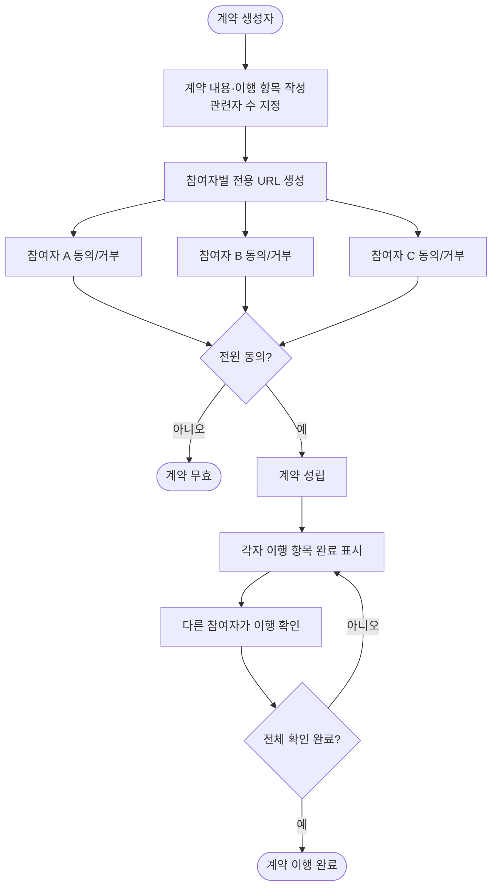

# 오프라인 컨트랙트 지원 서비스

오프라인(비공식) 계약을 온라인으로 디지털화하여, 계약 체결·이행·확인을 중개하는 서비스.
에스크로의 논리를 금전이 아닌 **약속 이행 확인**으로 확장한 개념.

---

## 핵심 개념

일상에서 구두·문자로 이루어지는 비공식 계약(돈 빌려줌, 일 맡김, 물건 거래 등)을 구조화된 흐름으로 처리.  
법적 효력보다는 **관계자 간 합의 기록 + 이행 추적**에 초점.

---

## 최소 기능

- 인증기능 생략. URL 기반 권한.

### 흐름

### 계약 생성

- 계약 제목, 계약 내용(자유 텍스트)
- 이행 항목 목록 (체크리스트 형태)
  - 예: "A가 30만원을 B에게 송금한다", "B가 로고 디자인 시안을 납품한다"
- 관련자 수 입력 (2인 이상)

### 참여자 URL

- 관련자 수만큼 전용 URL 자동 생성
- 각 URL은 단일 참여자에게만 유효 (행동 권한)
- URL은 계약 생성자가 직접 전달 (이메일·메신저 등)

### 동의 단계

- 참여자가 URL 접속 → 계약 내용 전문 확인
- **동의** 또는 **거부** 선택
- 거부 시: 계약 전체 무효, 참여자 전원에게 상태 표시
- 전원 동의 시: 계약 성립 → 이행 단계로 전환

### 이행 단계

- 각 참여자가 자신에게 할당된 이행 항목을 완료 표시
- 이행 완료 표시 시 다른 참여자에게 알림

### 이행 확인 단계

- 다른 참여자가 해당 이행 항목을 **확인**
- 모든 이행 항목이 전원 확인 완료되면 → 계약 이행 완료