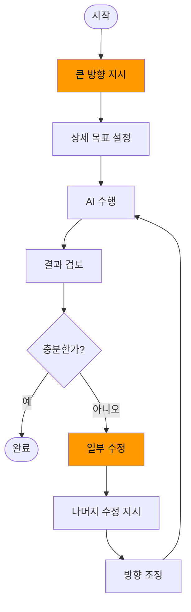

개발자는 미래에 어떻게 될까? 지금도 이미 AI가 훌륭한 결과를 내주고 있다. 그리고 난 그 결과를 검토하고 쓸만한지 아닌지 판단하는 일을 하고 있다.

> 첨삭 지도.

AI에게 일을 시키고, 결과를 보고, 그 결과가 적절한지 판단하고, 수정한다. 수정을 하더라도 모든 결과를 수정하지 않고 일부만 수정한 후 그걸 참고해서 나머지를 수정하라고 지시한다.

**큰 방향을 지시**하고, 상세 목표를 정하고, 수행을 시키고, 결과를 검토하고, **방향을 조정**하고, 조정된 방향으로 재수행을 시킨다. 그리고 충분할 때까지 반복한다.

학습 방향을 알려주고 학습 결과를 판단해서 방향을 조정한다는 점에서 **선생**이 하는 일이다. 재능있는 학생을 더 높은 단계로 나갈 수 있도록 안내하는 것.

- 큰 방향을 지시하기 : 구조 설계. 아키텍처, 레이어, 모듈, 패키지, 클래스, 블록. 어떻게 결과물을 구조화할 것인가?
- 상세 목표 설정하기 : 무엇을 개발할 것인가? 여기서 답안지-테스트 케이스-도 정해줘야 한다. 매번 **결과 검토**를 하기엔 인지적 부하가 너무 커진다.
- AI 수행 : 버튼 누르기.
- 결과 검토 : 품질을 보장할 수 있는 **개발자 전문성의 마지막 위치**. 동시에 인지적 부하가 커서 인지적 부담 완화[1][1], [2][2]를 위해 이 단계 횟수와 양을 최소화할 수 있어야 한다. 그렇지 않으면 인지적 항복[1][1], [2][2]이 발생해서 충분한 품질, 생산성을 달성할 수 없다.
- 일부 수정 : **첨삭 지도**. AI가 어디에서 오판을 했는지 알려줄 수 있는 곳을 수정해야 한다.

충분한 품질과 생산성을 달성하도록 학습 지도가 끝났다면, 개발자는 무엇을 해야 할 것인가? 같은 수준의 AI 학습이 필요한 다른 프로젝트로 이동하든가, 더 높은 수준의 학습을 지도할 수 있는 수준으로 스스로가 성장하든가.

스스로가 성장하려면 맡은 프로젝트가 그 정도 수준을 요구해야 한다. 그렇지 않으면 언젠가 다른 프로젝트를 찾아서 오는 다른 개발자와 경쟁할 수 없다.

현재 수준에 맞는 다른 프로젝트를 찾아 이동하려면 프로젝트와 나의 수준을 서로 간에 투명하게 공개할 수 있어야 한다. 그렇지 않으면 서로를 발견해서 이동하긴 너무나 어렵다.

아⋯ 쓰다보니 답답하고 무섭다.

## 참고

1. [Thinking—Fast, Slow, and Artificial: How AI is Reshaping Human Reasoning and the Rise of Cognitive Surrender][1]
2. [AddyOsmani.com - Cognitive Surrender][2]

[1]: https://papers.ssrn.com/sol3/papers.cfm?abstract_id=6097646
[2]: https://addyosmani.com/blog/cognitive-surrender