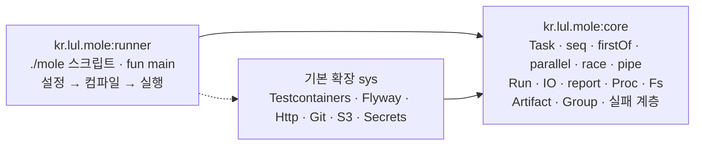

> 이 글은 **가상의 도구** `mole`에 대한 설계 메모다. 실제로 존재하는 도구가 아니고, "빌드 스크립트와 운영 스크립트가 불편한 지점을 처음부터 다시 설계하면 어떤 모양이 될까"를 정리한 개인적인 생각이다. 코드와 명령은 전부 설계 검토용 예시다.
>
> 이 글은 **태스크 자동화 런타임**만 다룬다. 이 런타임 위에 빌드 시스템을 얹어 Maven·Gradle을 대신하는 이야기 (`kr.lul.mole:kmp-build`)는 다음 글로 분리했다.

## 왜 이런 걸 생각했나

Gradle로 Kotlin Multiplatform 프로젝트를 굴리다 보면 반복해서 부딪히는 불만이 있다.

1. 빌드가 깨졌을 때 **도구 문제인지, 내 코드 문제인지, 테스트 실패인지** 한눈에 안 들어온다.
2. 빌드 스크립트와 프로젝트 코드가 따로 논다. 태스크 안에서 테스트 픽스처를 재사용하고 싶어도 쉽지 않고, 브레이크포인트를 걸어도 태스크 정의가 콜스택에 안 보인다.
3. `dependsOn`, `mustRunAfter`, 플러그인이 등록하는 태스크… 무엇이 어떤 순서로 도는지 추적하려면 `--scan`을 켜야 한다.

빌드 바깥도 마찬가지다. 배포·백업·마이그레이션·리포트를 셸 스크립트나 Python으로 짜 두면 타입이 없고, IDE가 못 따라오고, 프로젝트 코드의 상수 하나를 재사용하려 해도 문자열로 베껴 써야 한다.

그래서 우선순위를 뒤집어 봤다. **목표는 태스크 자동화 런타임이고, 빌드 시스템은 그 위에 올린 하나의 확장**이다. 자동화 코드를 프로젝트와 같은 Kotlin·같은 JVM·같은 디버거에 두면 불만 2가 바로 풀린다. 불만 1은 실행 단계마다 다른 예외 타입을 두는 실패 분류로, 불만 3은 "정의 순서 = 실행 순서"와 `--tree`로 답한다.

설계의 출발점이 된 요구는 글 끝의 [요구조건](#요구조건) 표에 R1 같은 번호로 정리했다. 본문은 그 번호로 참조한다.

## 전체 그림

### 두 아티팩트



| 아티팩트             | 무엇                                                                                                     | 없어도 되나                     |
|----------------------|----------------------------------------------------------------------------------------------------------|---------------------------------|
| `kr.lul.mole:core`   | 태스크를 정의·실행·보고하는 런타임. **스크립트도 `main`도 없는 순수 라이브러리**. 자동화 코드가 import 하는 것 | 안 된다. 모든 프로젝트의 바탕   |
| `kr.lul.mole:runner` | `./mole` 스크립트와 `fun main`. `mole.toml`을 읽어 엔진을 확보하고 설정 → 컴파일 → 실행을 진행            | 안 된다. 실행 주체              |
| 기본 확장 `sys`      | 서드파티를 끄는 편의 래핑 (Testcontainers, Flyway, Http, Git, S3, Secrets)                               | 직접 의존성으로 대체 가능       |

core와 runner를 나눈 이유는 **자동화 코드가 실행기를 import 하지 않게** 하기 위해서다. `Tasks.kt`는 `mole.task.*`만 보면 되고, 누가 어떻게 그것을 띄우는지는 몰라도 된다. 덕분에 실행기를 바꿔 끼울 수 있다 — 다음 글의 `kr.lul.mole:kmp-build`가 바로 그 경우로, runner의 `fun main`을 대신하고 `./mole` 스크립트와 `mole.toml` 항목도 다르다. core는 그대로다.

### 세 파일

| 파일                       | 무엇                                                                                              | 필수 |
|----------------------------|---------------------------------------------------------------------------------------------------|------|
| `mole.toml`                | 엔진 버전·확장·저장소. **데이터**. 자기 호스팅 순환을 버전으로 끊는 유일한 파일                   | ○    |
| `Project.kt`               | 저장소 정의. `src/mole`의 의존성과 저장소 공통 값. 저장소에 하나                                  | ○    |
| `src/mole/kotlin/Tasks.kt` | **태스크 정의**. core의 `Tasks`를 상속한 `object Tasks`. 자동화 코드 전부가 이 소스셋에 들어간다 | ○    |

`src/mole/kotlin`은 일반 소스셋이다. 파일 하나로 시작하지만 커지면 패키지를 나누고 리소스를 두고 테스트를 붙이면 된다. "스크립트"가 아니라 "코드"라는 것이 이 설계의 전부다.

### 세 단계 — 설정, 컴파일, 실행

`./mole <태스크>` 한 번은 이 순서를 지난다 (R5).


| 단계       | 하는 일                                                                                                                                       | 실패 타입                          |
|------------|-------------------------------------------------------------------------------------------------------------------------------------------------|------------------------------------|
| 부트스트랩 | `mole.toml`의 엔진 버전·확장을 확보한다. JDK 21+ 확인                                                                                            | `BootstrapFailure`                 |
| 설정       | `Project.kt`를 **설정 단위**로 따로 컴파일해 `object Project`를 초기화한다. 여기서 나오는 것이 `src/mole`의 클래스패스다                        | `ProjectDefError`                  |
| 컴파일     | 그 클래스패스로 `src/mole/kotlin`을 컴파일한다                                                                                                  | `CompileFailure`                   |
| 실행       | `object Tasks`를 로드해 요청한 태스크를 실행한다                                                                                                | `TestFailure`, `ProcessFailure`, … |

`Project.kt`는 Kotlin이지만 **설정 파일로 다룬다.** 프로젝트 소스와 같은 컴파일 단위에 넣지 않고, 엔진 API만 보이는 클래스패스에서 따로 컴파일해 초기화한다. 그래서 설정은 컴파일보다 항상 먼저 끝나고, `src/mole`의 산출물이 `Project.kt`에 되먹임될 수 없다. 이 경계가 실패 분류 (R1)의 첫 칸이다.

단계가 셋뿐이라 진단이 짧다. `mole.toml`이 틀렸나(3), 의존성 선언이 틀렸나(4), 내 코드가 안 붙나(5), 태스크가 실패했나(6+). 저자가 Gradle에서 가장 아쉬웠던 지점이 이것이고, 이 글의 설계 대부분은 그 네 칸을 흐리지 않기 위한 제약이다.

## 시작하기

### 설치

```bash
cd my-project
curl -fsSL https://mole.lul.kr/init.sh -o init.sh   # 예시. 실제로는 없는 주소다
sh init.sh
```

```text
mole  mole.cmd                # 부트스트랩 스크립트 (runner. 모든 프로젝트 동일)
mole.toml                     # 엔진 버전·확장·저장소
Project.kt                    # 저장소 정의
src/mole/kotlin/Tasks.kt      # 태스크 정의
```

```toml
# mole.toml
[engine]
runner = "kr.lul.mole:runner:0.5.0"           # 실행기. 이 줄이 ./mole 스크립트의 동작을 정한다
sha256 = "…"
extensions = ["sys"]                          # 엔진과 같은 버전으로 배포되는 기본 확장

[repositories]
maven = ["https://repo.maven.apache.org/maven2", "https://repo.lul.kr/maven-public"]
local = true                                  # ~/.m2

[project-libs]                                # Project.kt가 import 할 수 있는 라이브러리 (g:n:v만)
libs = ["kr.lul:mole-catalog:3.1.0"]
```

엔진은 부트스트랩 스크립트가 받아 온다. Maven 아티팩트라 사내 미러로도 배포된다 (R10). 요구사항은 JDK 21+.

`mole.toml`이 유일하게 코드가 아닌 파일인 이유는 순환 때문이다. 엔진을 실행해야 `Project.kt`를 컴파일할 수 있는데, 어느 엔진을 쓸지까지 코드로 적으면 닭이 먼저인지 달걀이 먼저인지 알 수 없다. 그래서 **"어떤 엔진"만 데이터로 적고 나머지는 전부 Kotlin**이다.

### 가장 작은 예

```kotlin
// Project.kt
import mole.project.Project

object Project : Project() {
    override val mole = dependencies {                                     // src/mole의 의존성
        implementation("software.amazon.awssdk:s3:2.32.0")
    }
}
```

```kotlin
// src/mole/kotlin/Tasks.kt
import mole.task.*                                                         // core
import mole.sys.*                                                          // sys 확장 (S3, Secrets, Clock)
import mole.runner.Mole                                                    // IDE에서 직접 실행하기 위한 main

object Tasks : Tasks() {
    val backup = task {
        Fs.temp("backup") { tmp ->
            Fs.zip(file("data"), tmp / "data.zip")
            S3.put(tmp / "data.zip", "s3://bucket/backup/${Clock.today()}.zip")
        }
    }

    val rotate = task { Secrets.rotate(env("VAULT_ADDR")) }

    val nightly = seq {
        +backup
        +rotate
        +task("report") { report.writeJson(file("build/reports/summary.json")) }
    }

    @JvmStatic
    fun main(args: Array<String>) = Mole.main(this, args)
}
```

```bash
$ ./mole nightly
```

`main`을 직접 둔 것은 IDE에서 거터의 ▶로 실행·디버그하기 위해서다 (R9). `./mole`로 돌리든 IDE에서 돌리든 같은 코드가 같은 JVM에서 돈다.

## 태스크

### 정의 — 주소와 순서는 다른 것이다

태스크에는 두 가지가 있다. **주소를 갖는 것**과 **순서에 들어가는 것**이다.

- `object Tasks`의 `val`로 선언하면 **주소**가 생긴다. 위 예의 `backup`은 `./mole backup`으로 부를 수 있다.
- 컨테이너 (`seq`, `parallel`…) 안에서 `+`로 넣으면 **그 컨테이너의 실행 순서**에 들어간다.

둘은 독립이다. `val`로만 선언하고 어느 컨테이너에도 넣지 않은 태스크는 주소로 직접 부를 때만 돈다. 컨테이너 안에 `+task("report") { }`처럼 익명으로 넣으면 순서에는 있지만 독립 주소는 없다 (`nightly:report`로 부른다). `./mole nightly`는 `backup → rotate → report`만 돌고, 같은 파일에 있어도 다른 `val`은 건드리지 않는다.

### 순서 = 정의 순서 = 의존 순서

`after`/`dependsOn`이 없다 (R3). 컨테이너 안에서 **앞 태스크가 뒤 태스크의 선행**이다. 순서는 소스에 적힌 순서 그대로이고, 별도의 그래프 선언이 없다.

| 컨테이너         | 자식   | 실행                  | 성공                                         | 콜스택                    |
|------------------|--------|-----------------------|----------------------------------------------|---------------------------|
| `seq { }` (기본) | `List` | 순서대로, 같은 스레드 | 모두 (AND)                                   | 보존                      |
| `firstOf { }`    | `List` | 순서대로              | 하나 성공 시 종료 (OR), 앞선 실패 `absorbed` | 보존                      |
| `parallel { }`   | `Set`  | 스레드별 동시         | 모두                                         | 스레드별 + 부모 스택 캡처 |
| `race { }`       | `Set`  | 스레드별 동시         | 하나 성공 시 나머지 interrupt                | 스레드별                  |

순서가 의미 있으면 `List`, 없으면 `Set`이다. 타입이 곧 문서라서 `parallel`에 순서를 기대하는 코드가 애초에 안 써진다.

한 번의 `./mole` 실행을 **Run**이라 한다. 한 Run 안에서 같은 태스크는 한 번만 실행되고, 두 번째부터는 앞의 결과를 재사용한다. 아래에서 `db`는 `migrate`와 `seed` 양쪽의 선행이지만 `./mole reset`은 `db`를 한 번만 띄운다. `--only`를 주면 선행을 건너뛴다.

```kotlin
object Tasks : Tasks() {
    val db = task { Postgres.start(run).also { run.env["DB_URL"] = it.jdbcUrl } }   // sys 확장
    val migrate = seq { +db; +task { Flyway.migrate(run.env["DB_URL"]!!) } }
    val seed = seq { +db; +task { SeedLoader.load(run.env["DB_URL"]!!) } }

    val reset = seq { +migrate; +seed }
}
```

### 입출력

태스크는 `Task<I, O>`다 (R4). 반환값이 있고, `pipe`로 이으면 앞 태스크의 출력이 뒤 태스크의 입력이 된다.

```kotlin
val collect = task<Unit, List<Path>> { Fs.glob("logs/*.jsonl") }
val parse = task<List<Path>, Report> { files -> Report.of(files.map { Fs.read(it) }) }
val publish = task<Report, Unit> { r -> Http.post(env("REPORT_URL"), r.toJson()) }

val daily = pipe { collect then parse then publish }
```

터미널 IO는 전역이 아니라 Run에 주입된다 (`IO(stdin, out, err)`). 태스크는 `io.out`을 쓴다. `parallel` 자식의 출력에는 `[backup]` 같은 프리픽스가 붙고, `Proc.run`의 자식 프로세스 출력도 같은 통로로 이어진다. 테스트에서 IO를 갈아 끼울 수 있다는 것이 `System.out`을 금지한 실질적 이유다.

### `Proc` — 시스템 커맨드

시스템 커맨드 실행과 파일 조작은 **core에 넣는다** (R11). 자동화의 7할이 이 둘이고, JDK만으로 구현되기 때문이다 (`ProcessBuilder`, `java.nio.file`). 서드파티를 끄는 것 (Testcontainers, Flyway, S3)만 기본 확장 `sys`로 분리한다.

```kotlin
val r = Proc.run(
    "npx", "tsc", "--noEmit",
    dir = file("web"),                        // 기본: 저장소 루트
    env = mapOf("CI" to "1"),                 // 부모 환경 + 추가
    timeout = 10.minutes,
    capture = true                            // false면 run.io로 스트리밍
)
r.exitCode; r.stdout; r.stderr; r.duration; r.command
r.orThrow()                                   // exit != 0 → ProcessFailure (재현 명령 포함)

Proc.shell("grep -c ERROR build/log/*.txt | sort")   // 명시적으로만 셸. 기본은 인자 배열
Proc.which("docker") ?: throw EnvironmentFailure("docker not found")
Proc.java(mainClass, classpath, jvmArgs)      // 명시 fork (격리가 필요한 작업)
Proc.start(...)                               // 백그라운드. run.onClose에 자동 등록
```

- 인자 배열이 기본이고 셸은 `Proc.shell`로만 쓴다. 인용·이스케이프 사고를 기본값에서 빼려는 것이다.
- interrupt를 존중한다 (`race` 패자, Ctrl-C → `Process.destroy` → `destroyForcibly`).
- 실패 리포트에 재현 명령을 `cd <dir> && <command>` 형태로 넣는다. 사람이 그대로 붙여넣어 재현할 수 있어야 한다.

### `Fs` — 파일 시스템

```kotlin
val f = file("build/out/app.json")            // 저장소 루트 기준
f.exists(); f.isDir(); f.size(); f.mtime(); f.sha256()

Fs.write(f, text); Fs.read(f); Fs.append(f, text)
Fs.copy(src, dst); Fs.move(src, dst); Fs.delete(f)                            // 디렉터리는 재귀
Fs.mkdirs(dir); Fs.list(dir); Fs.glob("src/**/*.kt")
Fs.sync(srcDir, dstDir, delete = true)                                        // 변경분만 복사
Fs.temp("prefix") { dir -> … }                                                // Run 종료 시 삭제
Fs.zip(dir, target); Fs.unzip(archive, dir)
Fs.watch(dir) { changes -> … }
Fs.fingerprint(paths)                                                         // up-to-date 판정용 해시
```

- 모든 조작이 `--trace`에 남는다: `fs.copy src → dst (12 files, 3.1 MB)`.
- `--dry-run`이면 `Fs`의 쓰기와 `Proc.run`은 기록만 하고 실행하지 않는다. 읽기는 실행한다.
- 경로는 `java.nio.file.Path`다. 별도 타입을 만들지 않는다 — 자동화 코드가 결국 JDK·서드파티 API와 값을 주고받기 때문이다.

### 동시성

`java.util.concurrent`만 쓴다 (R12). `parallel`/`race`는 이름 붙인 플랫폼 스레드와 `invokeAll`/`invokeAny`로 구현하고, 자동화 코드에서 kotlinx.coroutines는 쓰지 않는다. 자동화는 대부분 외부 프로세스 대기와 파일 IO라 코루틴의 이점이 작은 반면, 콜스택이 끊기면 불만 2의 답이 무너지기 때문이다.

## 설정 — `Project.kt`

```kotlin
// 엔진 API (mole.project)
abstract class Project {
    open val mole: Dependencies = dependencies { }      // src/mole의 의존성
    open val versionCatalog: VersionCatalog = versionCatalog { }
    open val publishTo: Repository? = null
}
```

```kotlin
// Project.kt
import mole.project.Project
import kr.lul.catalog.Groups                            // project-libs 로 받은 조직 공용 그룹

object Project : Project() {
    override val versionCatalog = versionCatalog {
        group("aws", "software.amazon.awssdk", "2.32.0")
        group("lul", Groups.lul)                        // 배포된 Group 인스턴스를 그대로

        library("s3", "aws", "s3")
        library("secrets", "aws", "secretsmanager")
        library("tc-postgres", "org.testcontainers:postgresql:1.21.3")
    }

    override val mole = dependencies {
        implementation(versionCatalog["s3"])
        implementation(versionCatalog["secrets"])
        implementation(versionCatalog["tc-postgres"])
    }
}
```

의존성은 네 형태를 받는다 (R6).

| 형태      | 예                                       | 타입                 |
|-----------|------------------------------------------|----------------------|
| 문자열    | `"g:n:v"`, `"g:n:v:classifier"`          | `Artifact.parse`     |
| 인스턴스  | `Artifact("g", "n", "v")`                | `Artifact`           |
| jar 경로  | `jar("lib/x.jar")`, `jars("lib/*.jar")`  | `JarFile`            |
| 그룹 호출 | `Groups.aws("s3")`                       | `Group` → `Artifact` |

```kotlin
// core (mole.dependency)
sealed interface Dependency
data class Artifact(
    val group: String, val name: String, val version: String? = null,
    val classifier: String? = null, val extension: String = "jar"
) : Dependency
data class JarFile(val path: Path) : Dependency
data class Platform(val bom: Artifact) : Dependency

/** 같은 그룹의 아티팩트를 여러 개 쓸 때 그룹 ID와 공용 버전을 한 번만 적기 위한 팩토리. Dependency가 아니다. */
data class Group(val id: String, val version: String? = null) {
    operator fun invoke(name: String, version: String? = this.version): Artifact = Artifact(id, name, version)
}
```

`versionCatalog`는 이 규모에서는 없어도 된다. 그룹과 버전을 한 곳에 모아 두고 싶을 때, 그리고 조직 공용 그룹 선언을 `project-libs`로 받아 쓸 때 값을 한다. 다음 글의 빌드 시스템에서 모듈 수십 개가 같은 카탈로그를 공유하게 되면 본격적으로 쓰인다.

의존성 해석은 POM을 읽고 충돌은 highest-wins가 기본이다. `./mole --why org.x:y`로 어느 선언에서 들어왔는지 본다.

## 실행과 관찰

### 투명성

도구가 결정한 것은 전부 출력할 수 있어야 한다 (R8). 숨은 상태가 없다는 것이 "자동화 도구와 통합된 프로젝트의 투명성"에 대한 이 설계의 정의다.

| 명령                         | 보여주는 것                                                                                 |
|------------------------------|---------------------------------------------------------------------------------------------|
| `./mole --tree [태스크]`     | 태스크 트리. 컨테이너 종류와 정의 위치(`Tasks.kt:16`)                                        |
| `./mole --explain <태스크>`  | 그 태스크가 실행할 순서, 입력 파일 해시, up-to-date 판정 이유                                |
| `./mole --deps`              | `src/mole`의 최종 클래스패스                                                                 |
| `./mole --why <g:n>`         | 의존성이 들어온 경로와 버전 선택 이유. 어느 `Group`·`library` 선언에서 왔는지 소스 위치까지 |
| `./mole --compile`           | 설정·컴파일까지만 하고 실행하지 않음                                                         |
| `./mole <태스크> --trace`    | 각 태스크 진입·종료·반환값·소요 시간과 소스 위치. `Proc` 명령과 `Fs` 쓰기 조작 전부          |
| `./mole <태스크> --dry-run`  | `Fs` 쓰기와 `Proc.run`을 기록만 하고 실행하지 않음                                           |
| `build/reports/summary.json` | 실행 결과 전체. 트리·시간·분류·실패 상세·absorbed                                            |

```text
$ ./mole --tree nightly
nightly                            seq                      Tasks.kt:18
├─ backup                          task                     Tasks.kt:6
├─ rotate                          task                     Tasks.kt:14
└─ report                          task (anonymous)         Tasks.kt:21
```

### 디버깅

`./mole idea`가 IntelliJ 프로젝트 파일을 생성한다 (R9). `Tasks.kt`의 `main` 거터 ▶ Debug로 태스크에 브레이크포인트를 걸면, 프로젝트 코드와 태스크 정의가 한 콜스택에 같이 보인다 (R2).

```text
SeedLoader.load(String)                          src/mole/kotlin/SeedLoader.kt:23
  server.domain.OrderFixtures.sample             프로젝트 코드 (같은 JVM)
  mole.task.Task.invoke                          engine (소스 첨부)
  mole.task.Seq.execute
  Tasks.seed$1.invoke                            src/mole/kotlin/Tasks.kt:12  ← 내가 쓴 seq
  mole.task.Seq.execute
  mole.task.Parallel$Child.run                   ← 스레드 경계
```

- `parallel` 자식은 별도 스레드다. 제출 시 부모 스택을 캡처해 예외에 `addSuppressed` 하고, `./mole idea`가 IntelliJ Async Stack Traces capture point를 등록해 체인을 이어 보여 준다.
- `./mole --debug <태스크>`: jdwp suspend=y, 포트 5005 (IntelliJ 관례).
- `Proc.run`은 프로세스 경계다. 재현 명령·stderr·소요 시간을 리포트에 남기는 것으로 대신한다.

### 실패 분류

실패의 1차 표현은 **예외 타입**이다 (R1). 모든 실패는 `MoleFailure`를 상속한 sealed 계층이고, 어느 단계에서 났는지가 타입에 들어 있다. 콘솔·`summary.json`·IDE 디버거가 같은 타입을 본다. 종료 코드는 따로 정하지 않고 **타입에서 유도**한다. 코드 표를 외우는 대신 타입 계층을 보면 되고, 새 타입을 추가할 때 코드 충돌을 컴파일러가 잡는다.

```kotlin
sealed class MoleFailure(val exitCode: Int, message: String, cause: Throwable? = null) : RuntimeException(message, cause)

class BootstrapFailure(…) : MoleFailure(3, …)          // 부트스트랩
class ProjectDefError(…) : MoleFailure(4, …)           // 설정
class CompileFailure(…) : MoleFailure(5, …)            // 컴파일

sealed class RunFailure(exitCode: Int, …) : MoleFailure(exitCode, …)   // 실행
class TestFailure(…) : RunFailure(6, …)
class ProcessFailure(…) : RunFailure(7, …)
class EnvironmentFailure(…) : RunFailure(8, …)
class AutomationError(…) : RunFailure(1, …)           // 태스크 코드가 던진 그 밖의 예외를 감쌈

// mole.runner.Mole
fun main(root: Tasks, args: Array<String>) {
    exitProcess(
        try {
            Run(root, args).execute(); 0
        } catch (f: MoleFailure) {
            report.failure(f); f.exitCode
        } catch (t: Throwable) {
            report.failure(AutomationError(t)); 1
        }   // 분류 안 된 예외는 전부 1
    )
}
```

| 예외                 | 단계       | exit | 뜻                                                                |
|----------------------|------------|------|-------------------------------------------------------------------|
| `BootstrapFailure`   | 부트스트랩 | 3    | JDK 없음, 엔진·확장 확보 실패, `mole.toml` 오류                   |
| `ProjectDefError`    | 설정       | 4    | `Project.kt` 컴파일·로드 실패, 없는 카탈로그 별칭, 의존성 해석 실패 |
| `CompileFailure`     | 컴파일     | 5    | `src/mole/kotlin` 컴파일 실패                                     |
| `TestFailure`        | 실행       | 6    | 테스트 실패                                                       |
| `ProcessFailure`     | 실행       | 7    | 외부 프로세스 비정상 종료. 재현 명령 포함                         |
| `EnvironmentFailure` | 실행       | 8    | Docker, node, 필수 CLI 부재                                       |
| `AutomationError`    | 실행       | 1    | 태스크 코드 예외, 분류되지 않은 모든 예외                         |

CI 스크립트는 종료 코드로 가른다: `3–4`면 설정, `5`면 내 코드, `6`이면 테스트, `1`·`7`·`8`이면 자동화·환경. 사람은 `summary.json`의 예외 타입과 스택을 본다. 같은 정보를 두 소비자에 맞게 렌더링한 것이다.

`Tasks.kt`에서도 같은 타입을 던지고 잡는다. `firstOf`가 앞선 실패를 `absorbed`로 삼키는 것, `race` 패자를 interrupt 하는 것도 이 계층 위에서 동작한다.

```text
$ ./mole nightly
[설정]   ok 0.3s
[컴파일] ok 1.8s · src/mole (12 files)
[실행]
nightly                            seq
├─ backup                          ok    4.2s   data.zip 18.4 MB → s3://…/2026-09-21.zip
├─ rotate                          FAIL  0.9s                                   ← EnvironmentFailure
│     vault: connection refused (VAULT_ADDR=http://127.0.0.1:8200)
└─ report                          skipped
EnvironmentFailure: rotate — vault unreachable  (build/reports/summary.json)
exit 8
```

### CI


```yaml
steps:
  - uses: actions/checkout@v7
  - uses: actions/setup-java@v6
    with: { distribution: temurin, java-version: 21 }
  - run: ./mole --compile            # 설정 + 컴파일. exit 3–5면 여기서 끝
  - run: ./mole nightly              # 실행. exit 1 또는 6–8
  - uses: actions/upload-artifact@v7
    if: always()
    with: { name: reports, path: build/reports }
```


## 규칙

| 하지 마세요                                    | 대신                                                  |
|------------------------------------------------|-------------------------------------------------------|
| `Project.kt`에서 `src/mole` 산출물 참조        | 구조상 불가. 설정은 컴파일보다 먼저 끝난다            |
| `project-libs`에 `jar()`·로컬 경로             | 버전 붙은 `g:n:v`만                                   |
| `seq` 본문에서 직접 스레드·코루틴              | `parallel`/`race`                                     |
| `System.out`                                   | `io.out`                                              |
| 셸 문자열로 커맨드 조립                        | `Proc.run`의 인자 배열. 꼭 필요하면 `Proc.shell`      |
| 태스크 정의를 `if`로 감싸기                    | 정의는 고정, 분기는 본문에서 `run.ci`로               |
| 환경변수를 `System.getenv`로 직접              | `env("NAME")`. `--trace`에 기록되고 마스킹 대상이 된다 |
| 주소만 필요한 태스크를 컨테이너에 넣기         | `val`로 선언만. 컨테이너 `+`는 실행 순서를 뜻한다     |

## FAQ

**셸 스크립트보다 나은 게 뭔가?** 타입, IDE, 디버거, 그리고 실패 분류다. 대신 JVM 기동 시간과 컴파일 시간을 낸다. 10줄짜리 한 번 쓰고 버릴 스크립트라면 셸이 낫다는 게 저자의 생각이다. 이 설계가 겨냥하는 것은 "프로젝트 코드와 상수·픽스처·도메인 타입을 공유해야 하는 자동화"다.

**`Tasks.kt`가 커지면?** 일반 소스셋이니 패키지를 나누고 파일을 쪼갠다. `object Tasks`는 진입점으로 남기고 실제 로직은 별도 클래스로 빼면 된다. 태스크 정의와 구현을 분리하기 좋은 지점이기도 하다.

**태스크가 만든 코드를 컴파일 입력으로?** 이 런타임에는 없다. `src/mole`은 한 번 컴파일되고 그다음 실행이다. 필요하면 두 번의 Run으로 나눈다 — 첫 Run이 소스를 만들고, 두 번째 Run이 그것을 쓴다.

**증분 빌드·캐시·데몬은?** 없다. `Fs.fingerprint` 기반 up-to-date 판정만 있다. 자동화 태스크는 대부분 외부 시스템을 건드려서 캐시 무효화 판단이 어렵고, 데몬은 "숨은 상태 없음"과 정면으로 부딪힌다. `src/mole` 컴파일이 느려지면 그때 원격 해시 캐시를 붙일 생각이다 (아래 TODO).

**`mole.toml` 대신 `Project.kt`에 엔진 버전을 적으면?** 순환이다. `Project.kt`를 컴파일하려면 이미 엔진이 있어야 한다. 이 파일 하나만 데이터로 남긴 이유다.

**확장은 어떻게 만드나?** 확장도 그냥 Maven 아티팩트다. 어느 저장소에서 `mole`로 만들어 버전을 붙여 배포하면 다른 저장소가 `mole.toml`의 `extensions`나 `Project.mole`에 적어 쓴다. `sys`도 그렇게 만든 것이고, 다음 글의 빌드 시스템도 같은 방식이다.

## TODO

설계상 자리는 잡혀 있지만 아직 채워야 할 것들이다.

- **실행기 교체 지점의 형식화.** `kmp-build`가 runner의 `main`을 대신하듯, 실행기를 바꿔 끼우는 경계를 인터페이스로 못박아야 한다. 지금은 "core는 실행기를 모른다"는 원칙만 있다.
- **원격 up-to-date 캐시** (해시 기반, 데몬 없이).
- **시크릿 마스킹**의 범위. `env()`로 읽은 값은 `--trace`에서 가리지만, 그 값이 문자열 조작을 거친 뒤에는 추적이 끊긴다.
- **`race` 패자의 부분 산출물 정리** 정책.
- **`AutomationError`가 감싸는 예외의 재시도**를 엔진이 가질지, 태스크에 맡길지.
- **관측**: 태스크 실행 결과를 OpenTelemetry로 내보내기.
- **IDE**: `./mole idea` 외에 VS Code/Fleet용 모델 출력.
- **오프라인 환경**의 엔진·확장 배포 (미러, 벤더링).

## 마치며

다시 말하지만 `mole`은 존재하지 않는다. 다만 자동화 코드를 "스크립트"가 아니라 "프로젝트의 일부인 코드"로 취급하면, 서두의 세 불만이 도구의 문제가 아니라 **경계 설정의 문제**였다는 게 보인다는 것이 저자의 생각이다. 실패가 어느 단계에서 났는지 타입이 말해 주고, 태스크와 프로젝트 코드가 같은 JVM에서 같은 디버거로 돌고, 순서가 소스에 적힌 순서와 같다. 이 세 가지만 지켜도 체감은 꽤 다를 것 같다.

다음 글에서는 이 런타임 위에 빌드 시스템을 얹는다. **빌드는 태스크 자동화의 특수한 경우**라는 관점으로 Maven·Gradle을 대신하는 `kr.lul.mole:kmp-build`를 다룬다. `kmp-build`는 runner의 `fun main`을 대신하고, `./mole` 스크립트와 `mole.toml`의 항목도 달라진다. 반면 `Tasks.kt`가 보는 core API는 이 글에서 설명한 그대로다.

## 부록

### 요구조건

설계의 출발점이 된 요구와 그에 대한 답이다.

| #   | 요구                                                  | 답                                                       |
|-----|-------------------------------------------------------|----------------------------------------------------------|
| R1  | 실패가 "설정 / 내 코드 / 태스크" 중 어디인지 즉시 구분 | 세 단계 경계 + 예외 타입에서 유도한 종료 코드            |
| R2  | 자동화 코드와 프로젝트 코드가 같은 JVM, 같은 디버깅   | 단일 JVM, 동기 직접 호출                                 |
| R3  | 태스크 트리, 독립 실행, 정의 순서 = 실행 순서         | `seq`/`firstOf`(List), `parallel`/`race`(Set)            |
| R4  | 타입 있는 입출력, 주입되는 터미널 IO                  | `Task<I,O>`, `pipe`, `IO`                                |
| R5  | 설정과 실행의 분리                                    | 설정 → 컴파일 → 실행, 다른 파일                          |
| R6  | 의존성: jar 경로 / Maven 아티팩트 / `"g:n:v"` / 인스턴스 | `Dependency` 계층                                     |
| R7  | 자동화 코드는 스크립트가 아니라 소스셋                | `src/mole/kotlin`, 패키지·리소스·테스트 가능             |
| R8  | 도구가 결정한 것은 전부 출력 가능                     | `--tree`, `--explain`, `--trace`, `--why`, `--deps`      |
| R9  | IDE가 자동화 코드를 직접 실행·디버그                  | `@JvmStatic main` + `./mole idea`                        |
| R10 | 엔진은 다운로드 기본, Maven 아티팩트로도 공유         | runner 부트스트랩 스크립트 + `mole.toml`                 |
| R11 | 시스템 커맨드·파일 조작·CI 보고까지 런타임에 포함     | core의 `Proc`/`Fs`/`report`                              |
| R12 | 동시성은 JDK 표준 → Apache → JetBrains 순             | `java.util.concurrent`만                                 |

### 라이브러리 선택 원칙

엔진 구현에 쓰는 라이브러리는 이 순서로 고른다 (R12).

| 순위 | 출처                | 예                                                                                        |
|------|---------------------|-------------------------------------------------------------------------------------------|
| 1    | JDK / Kotlin stdlib | `java.util.concurrent`, `ProcessBuilder`, `javax.tools`, `java.net.http`, `java.nio.file` |
| 2    | Apache              | Maven Resolver, Commons Compress                                                          |
| 3    | JetBrains           | `kotlin-compiler-embeddable` (대체 불가)                                                  |
| —    | 도메인 라이브러리   | Testcontainers, Flyway, JUnit Platform (`sys` 확장으로 격리)                              |

## 참고

1. [Kotlin Multiplatform][1]
2. [Gradle Version Catalogs][2]
3. [JUnit Platform Launcher API][3]
4. [Debug asynchronous code — IntelliJ IDEA][4]

[1]: https://kotlinlang.org/docs/multiplatform.html
[2]: https://docs.gradle.org/current/userguide/version_catalogs.html
[3]: https://junit.org/junit5/docs/current/user-guide/#launcher-api
[4]: https://www.jetbrains.com/help/idea/debug-asynchronous-code.html
