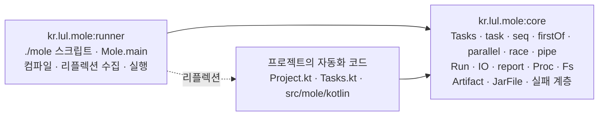

> 이 글은 **가상의 도구** `mole`에 대한 설계 메모다. 실제로 존재하는 도구가 아니고, 프로젝트에 필요한 자동화를 프로젝트가 관리하게 하는 방법을 상상해봤다.

## 왜 이런 걸 생각했나

웬만한 프로젝트에는 코드 바깥의 일이 딸려 온다. 배포, 백업, 스키마 마이그레이션, 리포트 수집, 정적 파일 처리, 릴리스 준비. 보통 `scripts/` 아래에 셸이나 Python으로 쌓이는데, 그러다 보면 반복해서 부딪히는 불만이 있다.

1. 실패했을 때 **환경이 틀린 건지, 내가 짠 자동화 코드가 틀린 건지, 작업 자체가 실패한 건지** 한눈에 안 들어온다. 종료 코드는 짜는 사람 나름이라 `1`이 그중 무엇인지 알 수 없고, 값을 규칙적으로 붙여 놓아도 그 규칙을 아는 사람만 읽는다.
2. 자동화 코드와 프로젝트 코드가 따로 논다. 프로젝트의 상수 하나, 도메인 타입 하나, 테스트 픽스처 하나를 재사용하려 해도 문자열로 베껴 써야 한다. 타입이 없고, IDE가 못 따라오고, 브레이크포인트도 못 건다.
3. 스크립트가 다른 스크립트를 부르기 시작하면 무엇이 어떤 순서로 도는지 추적할 방법이 없다. 결국 누군가 주석으로 순서를 적어 두고, 그 주석이 먼저 낡는다.

그래서 **프로젝트의 자동화를 프로젝트가 직접 관리하게** 해 봤다. 태스크를 프로젝트와 같은 Kotlin·같은 JVM·같은 디버거에 두면 불만 2가 바로 풀린다. 불만 1은 실행 단계마다 다른 예외 타입을 두고 그것을 리포트에 남기는 것으로, 불만 3은 "정의 순서 = 실행 순서"와 `--tree`로 답한다.

설계의 출발점이 된 요구는 글 끝의 [요구조건](#요구조건) 표에 R1 같은 번호로 정리했다. 본문은 그 번호로 참조한다.

## 전체 그림

### 두 아티팩트



| 아티팩트             | 무엇                                                                                                     | 프로젝트 코드와의 관계                |
|----------------------|------------------------------------------------------------------------------------------------------------|---------------------------------------|
| `kr.lul.mole:core`   | 태스크를 정의·실행·보고하는 런타임. **스크립트도 `main`도 없는 순수 라이브러리**                            | 자동화 코드가 `import` 한다           |
| `kr.lul.mole:runner` | `./mole` 스크립트와 `Mole.main`. 자동화 코드를 컴파일하고, 리플렉션으로 `Project`·`Tasks`를 찾아 실행한다 | 자동화 코드는 `main` 한 줄에서만 본다 |

core와 runner를 나눈 이유는 **자동화 코드가 실행기를 몰라도 되게** 하기 위해서다. `Tasks.kt`는 `mole.task.*`만 보면 되고, 누가 어떻게 그것을 띄우는지는 관심 밖이다. 태스크를 테스트할 때 실행기를 띄울 필요가 없고, 실행기가 바뀌어도 태스크 코드는 그대로다.

반대 방향, 즉 runner가 프로젝트를 아는 방법은 **리플렉션**이다. 컴파일된 클래스패스에서 기본 패키지의 `Project`와 각 디렉터리 패키지의 `Tasks`를 찾아 로드한다. 등록 파일도, 어노테이션 스캔도 없다. 경로가 곧 패키지이므로 어디를 찾아야 하는지가 디렉터리 구조에서 나온다 (R13).

확장도 아티팩트다. 클라우드 스토리지·시크릿 매니저를 감싼 `kr.lul.mole:cloud`, 컨테이너·오케스트레이터를 감싼 `kr.lul.mole:infra` 같은 것이 그 예다. 이 글의 예제는 확장 없이 core의 `Proc`·`Fs`만 쓴다.

### 네 파일

| 파일               | 위치                    | 무엇                                                     |
|--------------------|-------------------------|----------------------------------------------------------|
| `mole.toml`        | 저장소 루트             | 엔진 버전·저장소. **유일하게 코드가 아닌 파일**          |
| `Project.kt`       | 저장소 루트             | 자동화 코드의 의존성과 저장소 공통 값. 저장소에 하나     |
| `main.kt`          | 저장소 루트             | 진입점. 본문은 runner에 위임하는 한 줄                   |
| `Tasks.kt`         | 루트 · 각 모듈 디렉터리 | **태스크 정의**. 이 파일이 있는 디렉터리가 자동화 단위다 |
| `src/mole/kotlin/` | 루트 · 각 모듈 디렉터리 | 태스크가 쓰는 자동화 코드. 일반 소스셋                   |

`Tasks.kt`는 소스셋이 아니라 **모듈 디렉터리 바로 아래**에 둔다. 그 모듈로 무엇을 할 수 있는지가 디렉터리를 열자마자 보이는 편이 낫기 때문이다. 반면 그 태스크들이 쓰는 실제 코드는 `src/mole/kotlin` 소스셋이다. 파일 하나로 시작하지만 커지면 패키지를 나누고 리소스를 두면 된다. **선언은 눈에 띄는 곳에, 구현은 소스셋에** — 이 분리가 자동화 코드를 "스크립트"가 아니라 "코드"로 만든다 (R7).

`main`이 `Project.kt`가 아니라 따로 있는 이유는 컴파일 단계가 다르기 때문이다. `Project.kt`는 클래스패스를 정하는 설정이라 엔진 API만 보이는 상태에서 먼저 컴파일되고, `main`은 그렇게 정해진 클래스패스 위에서 컴파일된다. 한 파일에 두면 자기 자신을 컴파일하기 위해 자기 자신이 필요해진다.

### 네 단계

`./mole <태스크>` 한 번은 이 순서를 지난다 (R5).


| 단계       | 누가              | 하는 일                                                                                                                                    | 실패 타입                          |
|------------|-------------------|----------------------------------------------------------------------------------------------------------------------------------------------|------------------------------------|
| 부트스트랩 | `./mole` 스크립트 | `mole.toml`을 읽어 runner와 core를 확보한다. JDK 21+ 확인                                                                                      | `BootstrapFailure`                 |
| 설정       | runner            | `Project.kt`를 **설정 단위**로 따로 컴파일해 `object Project`를 초기화한다. 여기서 나오는 것이 자동화 코드의 클래스패스다                     | `ProjectDefError`                  |
| 컴파일     | runner            | 그 클래스패스로 모든 `Tasks.kt`·`src/mole/kotlin`·`main.kt`를 **한 컴파일 단위**로 컴파일한다                                                 | `CompileFailure`                   |
| 실행       | `main` → runner   | 컴파일 결과를 클래스패스에 얹어 `main`을 실행한다. `Mole.main`이 리플렉션으로 `Project`·`Tasks`를 모아 트리를 만들고 요청한 태스크를 실행한다 | `TaskFailure`, `ProcessFailure`, … |

`Project.kt`는 Kotlin이지만 **설정 파일로 다룬다.** 자동화 코드와 같은 컴파일 단위에 넣지 않고, 엔진 API만 보이는 클래스패스에서 따로 컴파일해 초기화한다. 그래서 설정은 항상 먼저 끝나고, 자동화 코드의 산출물이 `Project.kt`로 되먹임될 수 없다. 이 경계가 실패 분류 (R1)의 첫 칸이다.

모든 `Tasks.kt`와 `src/mole/kotlin`을 한 단위로 컴파일하는 것은 모듈 사이에 순서를 두지 않기 위해서다. 루트 `Tasks.kt`가 모듈의 `Tasks`를 import 하고, 모듈끼리도 서로 참조할 수 있다. 컴파일러가 한 번에 보므로 선언 순서 문제가 없고, 순환 참조는 컴파일 오류로 즉시 드러난다.

`./mole` 스크립트가 직접 하는 일은 엔진을 받아 오고 runner를 띄우는 것뿐이다. 이후 컴파일·수집·실행은 전부 runner가 한다. 그래서 어느 프로젝트에서든 `./mole`의 내용이 같고, 이 순서가 프로젝트마다 달라질 여지가 없다.

## 시작하기

### 설치

```bash
cd my-project
curl -fsSL https://mole.lul.kr/init.sh -o init.sh   # 예시. 실제로는 없는 주소다
sh init.sh
```

```text
mole  mole.cmd                # 부트스트랩 스크립트 (모든 프로젝트 동일)
mole.toml                     # 엔진 버전·저장소
Project.kt                    # 자동화 코드의 의존성
main.kt                       # 진입점
Tasks.kt                      # 루트 태스크
src/mole/kotlin/              # 루트 자동화 코드
```

```toml
# mole.toml
[engine]
runner = "kr.lul.mole:runner:0.5.0"
sha256 = "…"

[repositories]
maven = ["https://repo.maven.apache.org/maven2", "https://repo.lul.kr/maven-public"]
local = true                                  # ~/.m2

[project-libs]                                # Project.kt 가 import 할 수 있는 라이브러리
libs = ["kr.lul:mole-presets:3.1.0"]
```

`mole.toml`이 유일하게 코드가 아닌 파일인 이유는 순환 때문이다. 엔진이 있어야 `Project.kt`를 컴파일할 수 있는데 어느 엔진을 쓸지까지 코드로 적으면 닭이 먼저인지 달걀이 먼저인지 알 수 없다. 그래서 **"어떤 엔진"만 데이터로 적고 나머지는 전부 Kotlin**이다.

### 가장 작은 예

```kotlin
// Project.kt
import mole.project.Project

object Project : Project() {
    override val mole = dependencies {                     // 자동화 코드의 의존성
        implementation("org.jetbrains.kotlinx:kotlinx-serialization-json:1.9.0")
    }
}
```

```kotlin
// main.kt
fun main(args: Array<String>) = mole.runner.Mole.main(args)
```

```kotlin
// Tasks.kt
import mole.task.*

object Tasks : Tasks() {
    val clean = task { Fs.delete(dir(".mole/out")) }

    val collect = task {
        Fs.mkdirs(dir(".mole/out"))
        Fs.glob("logs/*.log").forEach { Fs.copy(it, dir(".mole/out") / it.fileName) }
    }

    val archive = seq {
        +clean
        +collect
        +task("zip") { Fs.zip(dir(".mole/out"), file(".mole/logs.zip")) }
    }
}
```

```bash
$ ./mole archive
```

`main`을 프로젝트에 둔 것은 IDE에서 거터의 ▶로 실행·디버그하기 위해서다 (R9). `./mole`로 돌리든 IDE에서 돌리든 같은 코드가 같은 JVM에서 돈다. 본문이 한 줄뿐인 이유는 해석과 실행을 전부 runner에 맡기기 때문이고, 그래서 이 파일은 처음 만든 뒤 고칠 일이 없다.

### 모듈이 있는 프로젝트

`Tasks.kt`가 있는 디렉터리가 자동화 단위다 (R13). 패키지는 저장소 루트 기준 상대 경로와 같아야 한다.

```text
my-project/
  mole  mole.toml
  Project.kt  main.kt
  Tasks.kt                           ← 루트 태스크 (기본 패키지)
  src/mole/kotlin/                   ← 루트 자동화 코드
  web/
    Tasks.kt                         ← package web
    src/mole/kotlin/Dist.kt          ← package web
    package.json  src/…              ← 이 모듈의 실제 내용
  db/
    Tasks.kt                         ← package db
    src/mole/kotlin/Schema.kt
    migration/V001__init.sql
  docs/                              ← Tasks.kt 없음. 자동화 단위가 아니다
```

```kotlin
// web/Tasks.kt
package web

import mole.task.*

object Tasks : Tasks() {
    val install = task { Proc.run("npm", "ci").orThrow() }               // 기본 디렉터리 = web/
    val build = seq {
        +install
        +task("bundle") { Proc.run("npm", "run", "build").orThrow() }
        +task("size") { Dist.report(dir("dist")) }                       // src/mole/kotlin/Dist.kt
    }
}
```

```kotlin
// web/src/mole/kotlin/Dist.kt
package web

import mole.task.*
import java.nio.file.Path

object Dist {
    fun report(dist: Path): Long {
        val total = Fs.glob("$dist/**/*").filterNot { it.isDir() }.sumOf { it.size() }
        io.out.println("dist: ${total / 1024}KB")
        return total
    }
}
```

```kotlin
// Tasks.kt — 루트
import mole.task.*
import web.Tasks as web
import db.Tasks as db

object Tasks : Tasks() {
    val check = parallel {
        +web.build
        +db.validate
    }
    val release = seq {
        +check
        +task("package") { Fs.zip(dir("web/dist"), file(".mole/site.zip")) }
    }
}
```

태스크 주소는 `모듈 경로:태스크`다. `./mole web:build`, `./mole db:validate`, 루트는 `./mole release`. 모듈이 없는 프로젝트는 앞부분 없이 태스크 이름만 쓴다.

## 태스크

### 정의 — 주소와 순서는 다른 것이다

태스크에는 두 가지가 있다. **주소를 갖는 것**과 **순서에 들어가는 것**이다.

- `object Tasks`의 `val`로 선언하면 **주소**가 생긴다. 위 예의 `install`은 `./mole web:install`로 부를 수 있다.
- 컨테이너 (`seq`, `parallel`…) 안에서 `+`로 넣으면 **그 컨테이너의 실행 순서**에 들어간다.

둘은 독립이다. `val`로만 선언하고 어느 컨테이너에도 넣지 않은 태스크는 주소로 직접 부를 때만 돈다. 컨테이너 안에 `+task("bundle") { }`처럼 익명으로 넣으면 순서에는 있지만 독립 주소는 없다 (`web:build:bundle`로 부른다). `./mole web:build`는 `install → bundle → size`만 돌고, 같은 파일에 있어도 다른 `val`은 건드리지 않는다.

### 순서 = 정의 순서 = 의존 순서

선행 관계를 따로 선언하는 API가 없다 (R3). 컨테이너 안에서 **앞 태스크가 뒤 태스크의 선행**이다. 순서는 소스에 적힌 순서 그대로이고, 순서를 바꾸려면 줄을 옮긴다.

| 컨테이너         | 자식   | 실행                  | 성공                                         | 콜스택                    |
|------------------|--------|-----------------------|----------------------------------------------|---------------------------|
| `seq { }` (기본) | `List` | 순서대로, 같은 스레드 | 모두 (AND)                                   | 보존                      |
| `firstOf { }`    | `List` | 순서대로              | 하나 성공 시 종료 (OR), 앞선 실패 `absorbed` | 보존                      |
| `parallel { }`   | `Set`  | 스레드별 동시         | 모두                                         | 스레드별 + 부모 스택 캡처 |
| `race { }`       | `Set`  | 스레드별 동시         | 하나 성공 시 나머지 interrupt                | 스레드별                  |

순서가 의미 있으면 `List`, 없으면 `Set`이다. 타입이 곧 문서라서 `parallel`에 순서를 기대하는 코드가 애초에 안 써진다.

한 번의 `./mole` 실행을 **Run**이라 한다. 한 Run 안에서 같은 태스크는 한 번만 실행되고, 두 번째부터는 앞의 결과를 재사용한다. 아래에서 `up`은 `migrate`와 `seed` 양쪽의 선행이지만 `./mole db:reset`은 `up`을 한 번만 실행한다. `--only`를 주면 선행을 건너뛴다.

```kotlin
// db/Tasks.kt
package db

import mole.task.*

object Tasks : Tasks() {
    val up = task { Proc.run("docker", "compose", "up", "-d", "postgres").orThrow() }
    val migrate = seq { +up; +task { Schema.apply(dir("migration")) } }
    val seed = seq { +up; +task { Schema.load(file("seed.sql")) } }

    val reset = seq { +migrate; +seed }
    val validate = task { Schema.lint(dir("migration")) }
}
```

### 입출력

태스크는 `Task<I, O>`다 (R4). 반환값이 있고, `pipe`로 이으면 앞 태스크의 출력이 뒤 태스크의 입력이 된다.

```kotlin
val collect = task<Unit, List<Path>> { Fs.glob("logs/*.jsonl") }
val parse = task<List<Path>, Summary> { files -> Summary.of(files.map { Fs.read(it) }) }
val write = task<Summary, Unit> { s -> Fs.write(file(".mole/summary.json"), s.toJson()) }

val daily = pipe { collect then parse then write }
```

터미널 IO는 전역이 아니라 Run에 주입된다 (`IO(stdin, out, err)`). 태스크는 `io.out`을 쓴다. `parallel` 자식의 출력에는 `[web:build]` 같은 프리픽스가 붙고, `Proc.run`의 자식 프로세스 출력도 같은 통로로 이어진다. 테스트에서 IO를 갈아 끼울 수 있다는 것이 `System.out`을 금지한 실질적 이유다.

### `Proc` — 시스템 커맨드

시스템 커맨드 실행과 파일 조작은 **core에 넣는다** (R11). 자동화의 대부분이 이 둘이고, 표준 라이브러리만으로 구현되기 때문이다. 서드파티를 끄는 것은 전부 확장으로 분리한다.

```kotlin
val r = Proc.run(
    "npm", "run", "build",
    dir = dir("web"),                         // 기본: 그 Tasks.kt가 있는 디렉터리
    env = mapOf("CI" to "1"),                 // 부모 환경 + 추가
    timeout = 10.minutes,
    capture = true                            // false면 run.io로 스트리밍
)
r.exitCode; r.stdout; r.stderr; r.duration; r.command
r.orThrow()                                   // exit != 0 → ProcessFailure

Proc.shell("grep -c ERROR logs/*.log | sort")   // 명시적으로만 셸. 기본은 인자 배열
Proc.which("docker") ?: throw EnvironmentFailure("docker not found")
Proc.start(...)                               // 백그라운드. run.onClose에 자동 등록
```

- 인자 배열이 기본이고 셸은 `Proc.shell`로만 쓴다. 인용·이스케이프 사고를 기본값에서 빼려는 것이다.
- 외부 프로세스의 종료 코드는 `r.exitCode`에 그대로 담는다. 다만 그 값이 무엇을 뜻하는지는 그 프로그램 나름이므로, `orThrow()`가 만드는 `ProcessFailure`에 명령·작업 디렉터리·stderr를 함께 담아 사람이 읽을 수 있게 한다.
- interrupt를 존중한다 (`race` 패자, Ctrl-C → `Process.destroy` → `destroyForcibly`).

### `Fs` — 파일 시스템

```kotlin
val f = file(".mole/out/app.json")            // 그 Tasks.kt가 있는 디렉터리 기준
val d = dir("dist")                           // root("...")는 저장소 루트 기준
f.exists(); f.isDir(); f.size(); f.mtime(); f.sha256()

Fs.write(f, text); Fs.read(f); Fs.append(f, text)
Fs.copy(src, dst); Fs.move(src, dst); Fs.delete(f)                            // 디렉터리는 재귀
Fs.mkdirs(d); Fs.list(d); Fs.glob("src/**/*.kt")
Fs.sync(srcDir, dstDir, delete = true)                                        // 변경분만 복사
Fs.temp("prefix") { tmp -> … }                                                // Run 종료 시 삭제
Fs.zip(d, target); Fs.unzip(archive, d)
Fs.watch(d) { changes -> … }
Fs.fingerprint(paths)                                                         // up-to-date 판정용 해시
```

- 모든 조작이 `--trace`에 남는다: `fs.copy src → dst (12 files, 3.1 MB)`.
- `--dry-run`이면 `Fs`의 쓰기와 `Proc.run`은 기록만 하고 실행하지 않는다. 읽기는 실행한다.
- 경로 타입은 플랫폼의 것을 그대로 쓴다. 자동화 코드가 결국 표준 라이브러리·서드파티 API와 값을 주고받기 때문이다.

### 동시성

`parallel`/`race`는 이름 붙인 플랫폼 스레드로 구현하고, 자동화 코드에서 코루틴은 쓰지 않는다 (R12). 자동화는 대부분 외부 프로세스 대기와 파일 IO라 코루틴의 이점이 작은 반면, 콜스택이 끊기면 불만 2의 답이 무너지기 때문이다.

## 설정 — `Project.kt`

```kotlin
// 엔진 API (mole.project)
abstract class Project {
    open val mole: Dependencies = dependencies { }      // 자동화 코드의 의존성
    open val repositories: List<Repository> = emptyList()
}
```

```kotlin
// Project.kt
import mole.project.Project
import kr.lul.mole.presets.Libs                         // project-libs 로 받은 조직 공용 좌표

object Project : Project() {
    override val mole = dependencies {
        implementation("org.jetbrains.kotlinx:kotlinx-serialization-json:1.9.0")
        implementation("org.jsoup:jsoup:1.21.2")
        implementation(jar("lib/legacy-report-1.2.jar"))
        implementation(Libs.commonsCompress)            // 배포된 Artifact 인스턴스를 그대로
    }
}
```

의존성은 세 형태를 받는다 (R6).

| 형태     | 예                                      | 타입             |
|----------|-----------------------------------------|------------------|
| 좌표     | `"g:n:v"`, `"g:n:v:classifier"`         | `Artifact.parse` |
| 인스턴스 | `Artifact("g", "n", "v")`               | `Artifact`       |
| jar 경로 | `jar("lib/x.jar")`, `jars("lib/*.jar")` | `JarFile`        |

```kotlin
// core (mole.dependency)
sealed interface Dependency
data class Artifact(
    val group: String, val name: String, val version: String? = null,
    val classifier: String? = null, val extension: String = "jar"
) : Dependency
data class JarFile(val path: Path) : Dependency
data class Platform(val bom: Artifact) : Dependency
```

버전 카탈로그 같은 장치는 두지 않는다. 자동화가 쓰는 의존성은 대개 열 개 안쪽이고, 좌표를 한 파일에 모아 두는 것 이상의 간접층은 값보다 부담이 크다는 것이 저자의 판단이다. 여러 저장소가 같은 버전을 공유해야 하면 좌표를 상수로 묶어 `project-libs`로 배포하면 된다 (위 `Libs.commonsCompress`).

원격 의존성은 POM을 읽어 해석하고, 충돌은 높은 버전이 이기는 것이 기본이다. `./mole --why org.x:y`로 어느 선언에서 들어왔는지 본다. 로컬 jar는 해석 없이 그대로 클래스패스에 붙는다.

## 실행과 관찰

### 투명성

도구가 결정한 것은 전부 출력할 수 있어야 한다 (R8). 숨은 상태가 없다는 것이 "자동화 도구와 통합된 프로젝트의 투명성"에 대한 이 설계의 정의다.

| 명령                         | 보여주는 것                                                                        |
|------------------------------|--------------------------------------------------------------------------------------|
| `./mole --tree [주소]`       | 태스크 트리. 컨테이너 종류와 정의 위치(`web/Tasks.kt:9`)                             |
| `./mole --modules`           | 리플렉션으로 찾은 자동화 단위와 각 `Tasks`의 FQN                                     |
| `./mole --explain <주소>`    | 그 태스크가 실행할 순서, 입력 파일 해시, up-to-date 판정 이유                        |
| `./mole --deps`              | 자동화 코드의 최종 클래스패스                                                        |
| `./mole --why <g:n>`         | 의존성이 들어온 경로와 버전 선택 이유. 어느 선언에서 왔는지 소스 위치까지            |
| `./mole --compile`           | 설정·컴파일까지만 하고 실행하지 않음                                                 |
| `./mole <주소> --trace`      | 각 태스크 진입·종료·반환값·소요 시간과 소스 위치. `Proc` 명령과 `Fs` 쓰기 조작 전부 |
| `./mole <주소> --dry-run`    | `Fs` 쓰기와 `Proc.run`을 기록만 하고 실행하지 않음                                   |
| `.mole/reports/summary.json` | 실행 결과 전체. 트리·시간·분류·실패 상세·absorbed                                    |

```text
$ ./mole --tree release
release                            seq                      Tasks.kt:12
├─ check                           parallel (unordered)     Tasks.kt:8
│  ├─ web:build                    seq                      web/Tasks.kt:7
│  │  ├─ web:install               task                     web/Tasks.kt:6
│  │  ├─ web:build:bundle          task (anonymous)         web/Tasks.kt:9
│  │  └─ web:build:size            task (anonymous)         web/Tasks.kt:10
│  └─ db:validate                  task                     db/Tasks.kt:13
└─ release:package                 task (anonymous)         Tasks.kt:14
```

### 디버깅

`./mole idea`가 IDE 프로젝트 파일을 생성한다 (R9). `main.kt`의 거터 ▶ Debug로 태스크에 브레이크포인트를 걸면, 프로젝트 코드와 태스크 정의가 한 콜스택에 같이 보인다 (R2).

```text
Schema.apply(Path)                               db/src/mole/kotlin/Schema.kt:23
  mole.task.Task.invoke                          engine (소스 첨부)
  mole.task.Seq.execute
  db.Tasks.migrate$1.invoke                      db/Tasks.kt:9  ← 내가 쓴 seq
  mole.task.Seq.execute
  mole.task.Parallel$Child.run                   ← 스레드 경계 (check)
  mole.runner.Mole.main                          runner
```

- `parallel` 자식은 별도 스레드다. 제출 시 부모 스택을 캡처해 예외에 `addSuppressed` 하고, `./mole idea`가 IDE의 비동기 스택 캡처 지점을 등록해 체인을 이어 보여 준다.
- `./mole --debug <주소>`: jdwp suspend=y, 포트 5005.
- `Proc.run`은 프로세스 경계다. 재현 명령·stderr·소요 시간을 리포트에 남기는 것으로 대신한다.

### 실패 분류

**종료 코드는 짜는 사람 나름이라 그것만으로는 원인을 가릴 수 없다.** 그래서 실패의 1차 표현은 **예외 타입**이다 (R1). 모든 실패는 `MoleFailure`를 상속한 sealed 계층이고, 어느 단계에서 났는지가 타입에 들어 있다. 콘솔·`summary.json`·IDE 디버거가 같은 타입을 본다.

```kotlin
sealed class MoleFailure(val exitCode: Int, message: String, cause: Throwable? = null) : RuntimeException(message, cause)

class BootstrapFailure(…) : MoleFailure(3, …)          // 부트스트랩
class ProjectDefError(…) : MoleFailure(4, …)           // 설정
class CompileFailure(…) : MoleFailure(5, …)            // 컴파일

sealed class RunFailure(exitCode: Int, …) : MoleFailure(exitCode, …)   // 실행
class TaskFailure(…) : RunFailure(6, …)                // 태스크가 실패로 판정
class ProcessFailure(…) : RunFailure(7, …)             // 외부 프로세스 비정상 종료
class EnvironmentFailure(…) : RunFailure(8, …)         // 필요한 도구·환경 부재
class AutomationError(…) : RunFailure(1, …)            // 태스크 코드가 던진 그 밖의 예외를 감쌈
```

```kotlin
// mole.runner.Mole
fun main(args: Array<String>) {
    exitProcess(
        try {
            Run(collect(), args).execute(); 0            // collect(): 리플렉션으로 Project·Tasks 수집
        } catch (f: MoleFailure) {
            report.failure(f); f.exitCode
        } catch (t: Throwable) {
            report.failure(AutomationError(t)); 1
        }
    )
}
```

각 타입에 `exitCode`를 붙여 두기는 하지만 그것은 **거친 신호**다. 종료 코드는 한 바이트뿐이고, 태스크가 부른 외부 프로그램의 코드와도 뒤섞인다. 그래서 사람도 CI도 `summary.json`의 예외 타입·단계·스택을 읽는 것을 기본으로 삼고, 콘솔 마지막 줄에도 타입 이름을 그대로 찍는다.

| 예외                 | 단계       | exit | 뜻                                                    |
|----------------------|------------|------|-------------------------------------------------------|
| `BootstrapFailure`   | 부트스트랩 | 3    | JDK 없음, 엔진 확보 실패, `mole.toml` 오류            |
| `ProjectDefError`    | 설정       | 4    | `Project.kt` 컴파일·로드 실패, 의존성 해석 실패       |
| `CompileFailure`     | 컴파일     | 5    | `Tasks.kt`·`src/mole/kotlin` 컴파일 실패, 패키지≠경로 |
| `TaskFailure`        | 실행       | 6    | 태스크가 실패로 판정                                  |
| `ProcessFailure`     | 실행       | 7    | 외부 프로세스 비정상 종료. 재현 명령 포함             |
| `EnvironmentFailure` | 실행       | 8    | Docker, node, 필수 CLI 부재                           |
| `AutomationError`    | 실행       | 1    | 태스크 코드 예외, 분류되지 않은 모든 예외             |

`Tasks.kt`에서도 같은 타입을 던지고 잡는다. `firstOf`가 앞선 실패를 `absorbed`로 삼키는 것, `race` 패자를 interrupt 하는 것도 이 계층 위에서 동작한다.

```text
$ ./mole release
[설정]   ok 0.3s
[컴파일] ok 2.1s · Tasks.kt ×3 · src/mole (7 files) · main.kt
[실행]
release                            seq
├─ check                           parallel (unordered)
│  ├─ web:build                    FAIL  6.4s                                   ← ProcessFailure
│  │     npm run build → exit 1
│  │     cd web && npm run build
│  │     ERROR in ./src/app.ts:14  TS2345: Argument of type 'string' …
│  └─ db:validate                  ok    1.2s   12 migrations
└─ release:package                 skipped
ProcessFailure: web:build:bundle — npm run build (exit 1)   (.mole/reports/summary.json)
```

### CI


```yaml
steps:
  - uses: actions/checkout@v7
  - uses: actions/setup-java@v6
    with: { distribution: temurin, java-version: 21 }
  - run: ./mole --compile            # 설정 + 컴파일
  - run: ./mole release
  - uses: actions/upload-artifact@v7
    if: always()
    with: { name: reports, path: .mole/reports }
```


실패 원인을 종료 코드로 판별하는 대신 `.mole/reports/summary.json`을 올려 둔다. 어느 단계에서 어떤 타입으로 실패했는지가 거기 들어 있고, 그 파일 하나면 로그를 뒤지지 않아도 된다.

## 구현

엔진은 **Kotlin Multiplatform으로 구현하되 1차는 `jvm()` 타깃만 켠다** (R14). core의 API는 플랫폼 독립으로 설계하고, `Proc`·`Fs`처럼 플랫폼이 필요한 부분만 `expect`/`actual`로 가른다.

| 지금                                                       | 나중                                                |
|------------------------------------------------------------|-----------------------------------------------------|
| core·runner 모두 `jvm()` 타깃만 배포                       | native 타깃을 켜서 JVM 없이 도는 `./mole`           |
| 자동화 코드는 JVM으로 컴파일. JVM 라이브러리를 그대로 사용 | 플랫폼별 자동화 코드. 공통 태스크는 common 소스셋에 |
| 의존성은 POM 좌표와 로컬 jar 경로                          | 타깃별 아티팩트 선택                                |

JVM부터 시작하는 이유는 자동화가 붙잡아야 할 생태계 — 컨테이너 SDK, 클라우드 SDK, 마이그레이션 도구 — 가 대부분 JVM에 있기 때문이다. 다만 처음부터 JVM 전용으로 짜 두면 나중에 타깃을 늘릴 때 API를 다시 설계해야 하므로, 시작부터 KMP 구조로 두고 타깃만 하나로 제한한다.

## 규칙

| 하지 마세요                            | 대신                                                   |
|----------------------------------------|--------------------------------------------------------|
| `Project.kt`에서 자동화 코드 참조      | 구조상 불가. 설정은 컴파일보다 먼저 끝난다             |
| `Project.kt`에 `main` 두기             | `main.kt`. 컴파일 단계가 다르다                        |
| `Tasks.kt`를 `src/mole/kotlin`에 두기  | 모듈 디렉터리 바로 아래. 구현만 소스셋에               |
| 패키지를 디렉터리와 다르게             | 리플렉션 수집의 전제다. 다르면 `CompileFailure`        |
| `project-libs`에 jar·로컬 경로         | 버전 붙은 좌표만                                       |
| `seq` 본문에서 직접 스레드·코루틴      | `parallel`/`race`                                      |
| `System.out`                           | `io.out`                                               |
| 셸 문자열로 커맨드 조립                | `Proc.run`의 인자 배열. 꼭 필요하면 `Proc.shell`       |
| 종료 코드로 실패 원인 판별             | 예외 타입과 `summary.json`                             |
| 태스크 정의를 `if`로 감싸기            | 정의는 고정, 분기는 본문에서 `run.ci`로                |
| 환경변수를 `System.getenv`로 직접      | `env("NAME")`. `--trace`에 기록되고 마스킹 대상이 된다 |
| 주소만 필요한 태스크를 컨테이너에 넣기 | `val`로 선언만. 컨테이너 `+`는 실행 순서를 뜻한다      |

## FAQ

**셸 스크립트보다 나은 게 뭔가?** 타입, IDE, 디버거, 그리고 실패 분류다. 대신 JVM 기동 시간과 컴파일 시간을 낸다. 열 줄짜리 한 번 쓰고 버릴 스크립트라면 셸이 낫다는 것이 저자의 생각이다. 이 설계가 겨냥하는 것은 "프로젝트 코드와 상수·타입·픽스처를 공유해야 하는 자동화"와 "여러 사람이 오래 고쳐 쓰는 자동화"다.

**`Tasks.kt`가 커지면?** 구현을 `src/mole/kotlin`으로 옮긴다. `Tasks.kt`에는 태스크의 이름과 순서만 남기고 실제 로직은 소스셋의 클래스로 빼는 것이 의도한 사용법이다. 위 예의 `Dist`·`Schema`가 그렇다.

**모듈마다 다른 의존성이 필요하면?** 지금은 저장소 하나의 클래스패스를 공유한다. 자동화 코드 전체가 한 컴파일 단위이기 때문이다. 모듈별 클래스패스는 아래 TODO에 있다.

**리플렉션으로 찾는다면 이름을 못 바꾸나?** `object Tasks`라는 이름과 "패키지 = 경로" 규칙이 전제다. 파일 이름은 관례일 뿐이라 바꿔도 되지만 객체 이름과 패키지는 규칙이다. `./mole --modules`가 무엇을 찾았는지 그대로 출력하므로 어긋나면 바로 보인다.

**두 번째 실행은 빨라지나?** 컴파일 결과는 재사용하고, 태스크는 `Fs.fingerprint` 기반 up-to-date 판정만 한다. 상주 프로세스는 쓰지 않는다. 자동화 태스크는 대부분 외부 시스템을 건드려서 결과를 캐시하면 언제 무효화할지 판단하기 어렵고, 상주 프로세스는 "숨은 상태 없음"과 정면으로 부딪히기 때문이다.

**`mole.toml` 대신 `Project.kt`에 엔진 버전을 적으면?** 순환이다. `Project.kt`를 컴파일하려면 이미 엔진이 있어야 한다. 이 파일 하나만 데이터로 남긴 이유다.

**확장은 어떻게 만드나?** 확장도 그냥 아티팩트다. 어느 저장소에서 `mole`로 만들어 버전을 붙여 배포하면 다른 저장소가 `Project.mole`에 좌표를 적어 쓴다. 확장을 만드는 일과 태스크를 쓰는 일에 문법 차이가 없다는 것이 의도한 바다.

## TODO

설계상 자리는 잡혀 있지만 아직 채워야 할 것들이다.

- **모듈별 의존성.** 지금은 저장소 하나의 클래스패스다. 모듈마다 다른 의존성을 주려면 컴파일 단위를 나눠야 하고, 그러면 모듈 간 순서가 생긴다. 그 순서를 무엇으로 정할지가 남은 문제다.
- **native 타깃.** JVM 없이 도는 `./mole`. `Proc`·`Fs`의 `actual` 구현과 의존성 해석을 플랫폼별로 갈라야 한다.
- **리플렉션 수집의 오류 메시지.** 패키지가 경로와 다르거나 `object Tasks`가 없을 때, 무엇을 어디서 찾다가 실패했는지 그대로 보여 줘야 한다.
- **시크릿 마스킹의 범위.** `env()`로 읽은 값은 `--trace`에서 가리지만, 그 값이 문자열 조작을 거친 뒤에는 추적이 끊긴다.
- **`race` 패자의 부분 산출물 정리** 정책.
- **`AutomationError`가 감싸는 예외의 재시도**를 엔진이 가질지, 태스크에 맡길지.
- **관측**: 태스크 실행 결과를 OpenTelemetry로 내보내기.
- **확장 생태계**: `cloud`, `infra` 확장의 API 범위. 어디까지 감싸고 어디부터 원래 SDK를 그대로 쓰게 할지.

## 마치며

다시 말하지만 `mole`은 존재하지 않는다. 다만 자동화 코드를 "스크립트"가 아니라 "프로젝트의 일부인 코드"로 취급하면, 서두의 세 불만이 도구의 문제가 아니라 **경계 설정의 문제**였다는 게 보인다는 것이 저자의 생각이다. 실패가 어느 단계에서 났는지 타입이 말해 주고, 태스크와 프로젝트 코드가 같은 JVM에서 같은 디버거로 돌고, 순서가 소스에 적힌 순서와 같다. 이 세 가지만 지켜도 체감은 꽤 다를 것 같다.

## 부록

### 요구조건

설계의 출발점이 된 요구와 그에 대한 답이다.

| #   | 요구                                                      | 답                                                      |
|-----|-----------------------------------------------------------|---------------------------------------------------------|
| R1  | 실패 원인이 "환경 / 내 코드 / 작업" 중 어디인지 즉시 구분 | 단계별 예외 타입 + `summary.json`. 종료 코드는 보조     |
| R2  | 자동화 코드와 프로젝트 코드가 같은 JVM, 같은 디버깅       | 단일 JVM, 동기 직접 호출                                |
| R3  | 태스크 트리, 독립 실행, 정의 순서 = 실행 순서             | `seq`/`firstOf`(List), `parallel`/`race`(Set)           |
| R4  | 타입 있는 입출력, 주입되는 터미널 IO                      | `Task<I,O>`, `pipe`, `IO`                               |
| R5  | 설정과 실행의 분리                                        | 설정 → 컴파일 → 실행, 다른 파일                         |
| R6  | 의존성: 좌표 / jar 경로 / 인스턴스                        | `Dependency` 계층. 별도 카탈로그 없음                   |
| R7  | 자동화 코드는 스크립트가 아니라 소스셋                    | 선언은 `Tasks.kt`, 구현은 `src/mole/kotlin`             |
| R8  | 도구가 결정한 것은 전부 출력 가능                         | `--tree`, `--modules`, `--explain`, `--trace`, `--why`  |
| R9  | IDE가 자동화 코드를 직접 실행·디버그                      | 프로젝트의 `main.kt` + `./mole idea`                    |
| R10 | 엔진은 다운로드 기본, 아티팩트 저장소로도 공유            | `./mole` 부트스트랩 + `mole.toml`                       |
| R11 | 시스템 커맨드·파일 조작·리포트까지 런타임에 포함          | core의 `Proc`/`Fs`/`report`                             |
| R12 | 콜스택을 보존하는 동시성                                  | 이름 붙인 플랫폼 스레드. 코루틴 안 씀                   |
| R13 | 디렉터리 구조 = 자동화 구조                               | `Tasks.kt`가 있는 디렉터리 = 자동화 단위, 패키지 = 경로 |
| R14 | 플랫폼 확장 여지를 남긴 구현                              | KMP 구현, 1차는 `jvm()` 타깃만                          |

### 라이브러리 선택 원칙

엔진 구현에 쓰는 라이브러리는 이 순서로 고른다.

| 순위 | 출처                     | 예                                                             |
|------|--------------------------|----------------------------------------------------------------|
| 1    | Kotlin stdlib / 표준 API | 프로세스 실행, 파일 시스템, HTTP 클라이언트, 동시성            |
| 2    | Apache                   | 의존성 해석 (Maven Artifact Resolver), 압축 (Commons Compress) |
| 3    | JetBrains                | `kotlin-compiler-embeddable` (대체 불가)                       |
| —    | 도메인 라이브러리        | 확장 아티팩트로 격리. core는 의존하지 않는다                   |

## 참고

1. [ProcessBuilder (Java Platform SE 21)][1]
2. [Apache Maven Artifact Resolver][2]
3. [Kotlin Multiplatform][3]
4. [Debug asynchronous code — IntelliJ IDEA][4]

[1]: https://docs.oracle.com/en/java/javase/21/docs/api/java.base/java/lang/ProcessBuilder.html
[2]: https://maven.apache.org/resolver/
[3]: https://kotlinlang.org/docs/multiplatform.html
[4]: https://www.jetbrains.com/help/idea/debug-asynchronous-code.html
