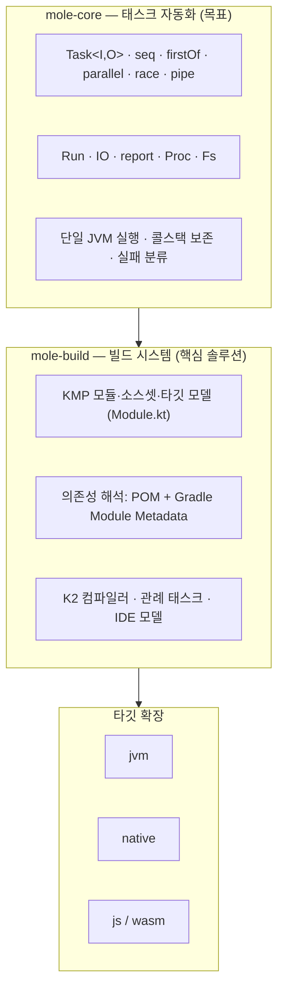
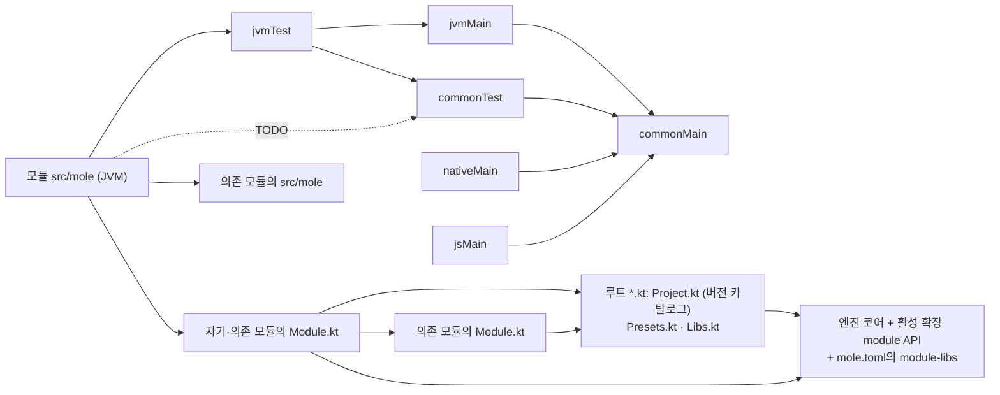

> 이 글은 **가상의 도구** `mole`에 대한 설계 메모다. 실제로 존재하는 도구가 아니고, "Gradle이 불편한 지점을 처음부터 다시 설계하면 어떤 모양이 될까"를 정리한 개인적인 생각이다. 코드와 명령은 전부 설계 검토용 예시다.

## 왜 이런 걸 생각했나

Gradle로 Kotlin Multiplatform 프로젝트를 굴리다 보면 반복해서 부딪히는 불만이 있다.

- 빌드가 깨졌을 때 **빌드툴 문제인지, 내 코드 문제인지, 테스트 실패인지** 한눈에 안 들어온다.
- 빌드 스크립트와 프로젝트 코드가 따로 논다. 태스크 안에서 테스트 픽스처를 재사용하고 싶어도 쉽지 않고, 브레이크포인트를 걸어도 태스크 정의가 콜스택에 안 보인다.
- `dependsOn`, `mustRunAfter`, 플러그인이 등록하는 태스크… 무엇이 어떤 순서로 도는지 추적하려면 `--scan`을 켜야 한다.

그래서 우선순위를 뒤집어 봤다. **태스크 자동화 프레임워크가 목표이고, 빌드 시스템은 그 위에 올린 핵심 솔루션**이다. 빌드 설정 (`Module.kt`)과 태스크 자동화 코드가 한 프로젝트에 공존해도 되고 어느 한쪽만 있어도 된다. 전부 하나의 JVM에서 실행·디버깅되고, 테스트 코드 브레이크포인트의 콜스택에 태스크 정의가 보인다.

## 구성

### 두 층



| 층                  | 무엇                                                                                              | 프로젝트에 있는 것         | 없어도 되나                                                                 |
|---------------------|---------------------------------------------------------------------------------------------------|----------------------------|-----------------------------------------------------------------------------|
| **mole-core**       | 태스크 트리를 정의·실행·보고하는 런타임                                                           | `src/mole/kotlin/Tasks.kt` | 빌드만 쓰는 프로젝트는 관례 태스크만으로 동작                               |
| **mole-build**      | core 위에 만든 빌드 시스템. `Module.kt`로 모듈을 정의하면 컴파일·테스트·패키징 관례 태스크가 생김 | `Module.kt`                | 자동화만 쓰는 프로젝트(운영 스크립트, 데이터 잡, CI 파이프라인)는 없어도 됨 |
| **타깃 확장**       | build의 타깃별 컴파일러·테스트 러너                                                               | `mole.toml`의 `extensions` | build를 안 쓰면 불필요                                                      |
| **기본 확장 `sys`** | 서드파티를 끄는 편의 래핑(Testcontainers, Flyway, Http, Git)                                      | `mole.toml`의 `extensions` | 직접 의존성으로 대체 가능                                                   |

세 가지 프로젝트 형태가 모두 정상이다.

| 형태          | 파일                                    | 예                                                                  |
|---------------|-----------------------------------------|---------------------------------------------------------------------|
| 빌드 + 자동화 | `Project.kt` + `Module.kt` + `Tasks.kt` | 서비스 저장소. 컴파일·테스트는 관례, DB 준비·배포·보고는 `Tasks.kt` |
| 빌드만        | `Project.kt` + `Module.kt`              | 라이브러리 저장소. `./mole build`, `./mole test`로 충분             |
| 자동화만      | `Project.kt` + `Tasks.kt`               | 운영 자동화, 인프라 작업, 데이터 파이프라인. `Module.kt` 없음       |

### 두 단계

빌드 시스템을 쓰는 프로젝트에서 실행은 두 단계로 나뉜다. 자동화만 쓰는 프로젝트는 B만 있다.

|             | A. 컴파일 단계                                                                          | B. 자동화 단계                                                                                      |
|-------------|-----------------------------------------------------------------------------------------|-----------------------------------------------------------------------------------------------------|
| 코드 위치   | **루트의 `*.kt`** (`Project.kt`, `Presets.kt`, `Libs.kt`) **+ 각 모듈 루트의 `Module.kt`** — 하나의 컴파일 단위 | 루트와 각 모듈의 `src/mole/kotlin` 소스셋                                              |
| import 가능 | 엔진 코어 + 활성 확장의 `module` API + `Project`·루트 `*.kt` + 의존 모듈의 `Module`     | `jvmTest` + `jvmMain` + `commonMain` + 자기·의존 모듈의 `Module`·`Tasks` + 엔진 `task` API |
| 정하는 것   | 버전 카탈로그, 저장소 공용 프리셋, 타깃, 소스셋별 의존성, 컴파일러 옵션, KSP/APT, 생성 소스 | 태스크 트리 (관례 태스크의 참조·재정의·확장)                                           |
| 확장 방식   | 타깃 확장 (엔진과 함께 배포) + 루트 `*.kt` (저장소 로컬 프리셋)                         | 일반 코드                                                                              |
| 실행 환경   | JVM                                                                                     | JVM. native/js 산출물은 프로세스로 실행                                                |

A는 Gradle이 관례로 해주던 것의 최소 집합이고, B는 플러그인·태스크로 하던 것 전부다. A의 확장점은 타깃 확장과 루트 `*.kt` 둘뿐이다. `kr.lul.mole:build`는 `Project.kt`·루트 `*.kt`·모든 `Module.kt`를 설정 파일로 보고 한 번에 컴파일하므로 셋 사이에 순서는 없다.

B는 다시 두 층으로 읽을 수 있다. **기본 자동화**는 A의 결과와 메인 코드 (`commonMain`, `jvmMain`)만 쓰는 태스크 (컴파일·패키징·배포·운영)이고, **테스트 자동화**는 그 위에 테스트 코드 (`commonTest`, `jvmTest`)까지 쓰는 태스크 (테스트 실행·픽스처 준비)다. 둘 다 같은 `src/mole`에 두고 소스셋을 나누지 않는다. 층은 클래스패스와 컴파일 순서의 문제이지 파일 배치의 문제가 아니기 때문이다.

### 되먹임 — A는 B를 라이브러리로 굳힌 것

구조적으로 컴파일 단계 (A)는 **자동화 단계 (B)의 코드를 라이브러리로 굳혀 놓은 것**이다. 엔진 코어·타깃 확장·KMP 빌드 시스템 (`kr.lul.mole:kmp-build`)은 전부 어느 저장소의 B 단계 코드가 아티팩트로 배포된 결과이고, 엔진 자신도 `mole`로 빌드된다 (자기 호스팅).

이 되먹임은 **버전 붙은 아티팩트 경계를 넘어서만** 허용한다.

| 경로                                                                                 | 허용                | 이유                                                                                                |
|--------------------------------------------------------------------------------------|---------------------|-----------------------------------------------------------------------------------------------------|
| 저장소 X의 `src/mole` → 배포(`kr.lul.mole:kmp-build:0.5.0`) → 저장소 Y의 `mole.toml` | ○                   | 엔진·확장·KMP 빌드 시스템이 만들어지는 정상 경로. `kmp-build` 자체가 이 경로로 배포된 B 단계 코드다 |
| 루트 `*.kt` (`Presets.kt`) → 같은 저장소의 각 `Module.kt`                            | ○                   | 저장소 로컬 프리셋. 같은 A 컴파일 단위 안의 참조일 뿐 되먹임이 아니다                               |
| 같은 저장소 안에서 `src/mole` 산출물을 `Module.kt`가 참조                            | **×** (엔진이 거부) | 한 Run 안의 순환. A가 B보다 먼저 끝나야 한다는 전제가 깨짐                                          |
| 같은 저장소의 이전 빌드 산출물을 `jar()`로 A에 넣기                                  | ×                   | "지금 코드"와 "굳힌 코드"가 한 저장소에 공존해 어느 쪽이 진실인지 헷갈림                            |

권장하지 않는 이유는 기술이 아니라 인지 부담이다. 한 저장소 안에서 같은 코드가 "실행되는 태스크"이면서 "컴파일을 정하는 라이브러리"이면, 실패 원인을 A/B로 가르는 첫 분류 (R1)가 무너진다. 저장소 안에서 공유하는 프리셋은 루트 `*.kt`에 두고, 저장소 밖으로 공유하는 프리셋은 별도 저장소로 분리해 버전을 붙여 배포한다.

## 설치

```bash
cd my-project
curl -fsSL https://mole.lul.kr/init.sh | bash
```

```text
mole  mole.cmd                # 부트스트랩 (모든 프로젝트 동일)
mole.toml                     # 엔진 버전·확장·저장소 (데이터. 순환을 끊는 유일한 파일)
Project.kt                    # 저장소 정의. 버전 카탈로그 인스턴스 (Project.versionCatalog)
Libs.kt                       # 카탈로그 위에 얹는 별칭 (선택)
src/mole/kotlin/Tasks.kt      # 루트 자동화 (선택)
```

```toml
# mole.toml
[engine]
version = "0.5.0"
sha256 = "…"
extensions = ["jvm", "native", "js", "sys"]   # 타깃 확장 + 기본 확장. 엔진과 같은 버전으로 배포됨

[repositories]
maven = ["https://repo.maven.apache.org/maven2", "https://repo.lul.kr/maven-public"]
local = true                                  # ~/.m2

[module-libs]                                 # Project.kt·Module.kt가 import 할 수 있는 확장 라이브러리
libs = ["kr.lul.mole:kmp-build:0.5.0"]
```

Gradle 대응: `mole.toml` ≈ `gradle-wrapper.properties` + `settings.gradle.kts`의 `pluginManagement`. 모듈 목록 (`include`)은 없다. 디렉터리가 곧 모듈이다.

자동화만 쓰는 프로젝트는 `extensions = []`로 두고 `Module.kt` 없이 `Project.kt`와 `Tasks.kt`만 둔다.

```kotlin
// Project.kt — 자동화 전용 프로젝트
object Project : mole.module.Project() {
    override val mole = dependencies {                                     // 루트 src/mole 의존성
        implementation("org.testcontainers:postgresql:1.21.3")
        implementation("software.amazon.awssdk:s3:2.32.0")
    }
}
```

```kotlin
// src/mole/kotlin/Tasks.kt
object Tasks : RootTasks() {
    val backup = task {
        Fs.temp("backup") { tmp -> Fs.zip(file("data"), tmp / "data.zip"); S3.put(tmp / "data.zip", "s3://bucket/backup/${Clock.today()}.zip") }
    }
    val rotate = task { Secrets.rotate(env("VAULT_ADDR")) }
    val nightly = seq { +backup; +rotate; +task("report") { report.writeJson(file("build/reports/summary.json")) } }

    @JvmStatic
    fun main(args: Array<String>) = Mole.main(this, args)
}
```

`./mole nightly`. A 단계는 `Project.kt`만 컴파일하고, 모듈이 없으니 바로 B로 넘어간다. 요구사항은 JDK 21+.

## 프로젝트 구조

```text
my-project/                          ← 루트 (object Project, 기본 패키지. 모듈이 아님)
  mole  mole.toml
  Project.kt  Presets.kt  Libs.kt   ← A. 저장소 정의 + 공용 프리셋 + 카탈로그
  src/mole/kotlin/Tasks.kt           ← B. 루트 자동화
  server/                            ← 그룹 (object Module 없음)
    common/                          ← 모듈 server/common, 패키지 server.common
      Module.kt                      ← A
      src/commonMain/kotlin
      src/commonTest/kotlin
    domain/                          ← 모듈 server/domain
      Module.kt                      ← A
      src/commonMain/kotlin
      src/jvmMain/kotlin     src/jvmMain/resources
      src/jvmTest/kotlin
      src/nativeMain/kotlin
      src/mole/kotlin/Tasks.kt       ← B
  cli/                               ← 모듈 cli (native + jvm)
    Module.kt
    src/commonMain/kotlin
    src/linuxX64Main/kotlin
  web/                               ← 모듈 web (js)
    Module.kt
    src/jsMain/kotlin
  lib/legacy-pricing-1.2.jar
  build/                             ← 산출물 (gitignore)
```

규칙:

- **루트의 `mole` 스크립트 기준 상대 경로를 패키지로 갖고, `Module` 타입을 상속한 `object Module`이 있으면 그 디렉터리가 모듈**이다. 세 조건이 전부 맞아야 한다: ① 이름이 `Module`인 `object`, ② 패키지 = 상대 경로, ③ 엔진의 `mole.module.Module`(또는 그 하위 `KmpModule`/`JvmModule`…)을 상속. `server/domain/`은 `package server.domain`의 `object Module : KmpModule()`이 있을 때 모듈이 된다. 루트는 모듈이 아니라 기본 패키지의 `object Project`이며, 저장소에 하나뿐이다. 조건이 맞는 객체가 없는 디렉터리는 그룹 (경로만 제공). `src/` 유무는 무관하다.
- 엔진은 디렉터리 경로에서 FQN `server.domain.Module`을 유도해 로드한다 (클래스패스 스캔 없음). 로드한 객체가 `mole.module.Module`의 인스턴스인지 확인하고, 아니면 그 디렉터리는 모듈이 아니다 — 우연히 이름만 `Module`인 객체가 모듈로 오인되는 것을 막는다. 파일 이름은 관례상 `Module.kt`를 쓰지만 판정에는 쓰이지 않는다. 패키지가 경로와 다르거나 타입이 맞지 않는 객체를 다른 곳에서 `api(...)`로 넘기면 `ModuleDefError`.
- 모듈 간 의존은 **import 한 `Module` 객체를 넘기는 것**으로 표현한다. `api(server.common.Module)`. 문자열 경로 없음.
- 소스셋은 KMP Gradle 관례 그대로: `src/<sourceSet>/kotlin`, `src/<sourceSet>/resources`.
- 루트의 `*.kt` (`Project.kt`, `Presets.kt`, `Libs.kt`)와 모든 `Module.kt`는 하나의 A 컴파일 단위다. `Module.kt`는 `Project`, 루트의 다른 `*.kt`, 의존 모듈의 `Module`을 import 한다.
- `src/mole`은 JVM 소스셋이며 자동화 전용이다. 자기 `Module`, 의존 모듈의 `Tasks`, 그리고 그 모듈에 `jvm` 타깃이 있으면 `jvmTest → jvmMain → commonMain`을 본다. `commonTest`는 TODO다 — 지금은 `jvm` 타깃이 있을 때 `jvmTest` 컴파일에 딸려 오는 것만 보인다. `jvm` 타깃이 없으면 엔진 API만 보고 native/js는 산출물로 다룬다.
- 태스크 주소 = 모듈 경로 `:` 타깃 `:` 태스크. `server/domain:jvm:test`, `cli:linuxX64:link`, 집계는 `server/domain:test`, 루트는 `ci`.



### 왜 모듈 정의가 모듈 루트에 있나

"컴파일 단계 코드가 굳이 소스셋 디렉터리에 있어야 하나"를 놓고 비교한 결과다.

| 안                                                | 위치·발견                                                    | 장점                                                                                                        | 단점                                                                               | 판정                                          |
|---------------------------------------------------|--------------------------------------------------------------|-------------------------------------------------------------------------------------------------------------|------------------------------------------------------------------------------------|-----------------------------------------------|
| ① `src/module/kotlin/Module.kt` 소스셋            | 소스셋 관례                                                  | 클래스패스가 소스셋 단위로 명확                                                                             | `build.gradle.kts`가 모듈 루트에 있는 것과 어긋남. 한 파일을 위해 세 단계 디렉터리 | 탈락                                          |
| ② **모듈 루트 `*.kt` + 마커 타입 + 디렉터리→FQN** | 루트의 `*.kt`, `Module` 상속, 경로에서 FQN 유도 후 타입 검사 | Gradle과 같은 위치. **경로 = 패키지이고 `Module`을 상속한 `object Module` 존재 = 모듈**. 발견에 스캔 불필요 | 패키지 = 경로 규칙 필요                                                            | **채택**                                      |
| ③ 모듈 루트 + 클래스패스 스캔                     | `Module` 구현을 리플렉션으로 전부 탐색                       | 패키지 자유                                                                                                 | 스캔 비용, 우연한 발견, 역추적 필요                                                | 탈락                                          |
| ④ import 자체가 의존 선언                         | `import server.common.Module`만으로 의존                     | 가장 짧음                                                                                                   | 옵션만 읽으려는 import와 구분 불가. 암묵적                                         | 탈락. 대신 `api(server.common.Module)`로 명시 |

자동화 코드 (`src/mole/kotlin`)는 소스셋으로 남긴다. 자동화는 리소스·여러 파일·`jvmTest` 의존을 갖는 "코드"이고, 모듈 정의는 "선언"이라 성격이 다르기 때문이다.

## A. 컴파일 단계 — `Module.kt`

```kotlin
// server/domain/Module.kt
package server.domain

import mole.module.*
import mole.jvm.*                                  // jvm 확장 API
import mole.native.*                               // native 확장 API
import server.common.Module as common              // 다른 모듈의 컴파일 단계 코드
import Presets                                     // 루트 *.kt의 저장소 공용 프리셋
import Libs

object Module : KmpModule() {

    override val targets = targets {
        jvm { target = 21 }
        linuxX64()
        macosArm64()
        js { nodejs() }
    }

    override val sourceSets = sourceSets {
        commonMain {
            api(common)                                              // 모듈 의존 = import 한 객체
            implementation(Libs.coroutines)
            implementation(Libs.serialization)
        }
        commonTest { implementation(Libs.kotlinTest) }

        jvmMain {
            platform(Libs.springBom)
            implementation(Libs.springStarter)
            implementation("org.postgresql:postgresql:42.7.5")
            implementation(Artifact("com.zaxxer", "HikariCP", "7.0.2"))
            implementation(jar("lib/legacy-pricing-1.2.jar"))
            ksp(Libs.micronautDataKsp)
        }
        jvmTest {
            implementation(Libs.junit)
            implementation(Libs.tcPostgres)
        }
        nativeMain { implementation(Libs.kotlinxIo) }
        mole { implementation(Libs.tcPostgres) } // 자동화 소스셋 의존성
    }

    override val kotlin = Presets.kotlin                           // 루트 Presets.kt의 프리셋
    override val jvm = common.jvm                                  // 다른 모듈의 옵션 재사용
    override val native = NativeOptions(binaries = { executable("domain-cli") { entryPoint = "server.domain.main" } })

    override val generate = generate(commonMain) {
        kotlinFile(
            "server/domain/BuildInfo.kt", """
            package server.domain
            object BuildInfo { const val VERSION = "${Git.describe()}"; const val COMMIT = "${Git.sha()}" }
        """
        )
    }
}
```

타깃이 하나뿐인 모듈은 `JvmModule`/`JsModule`/`NativeModule`을 쓰면 `commonMain` 대신 `main`/`test` 소스셋 이름을 쓴다.

`Presets`는 루트에 둔 저장소 공용 코드다. `Project.kt`·`Module.kt`와 같은 A 컴파일 단위라 모든 모듈이 import 할 수 있다.

```kotlin
// Presets.kt — 루트. 모든 Module.kt가 공유하는 옵션
object Presets {
    val kotlin = KotlinOptions(languageVersion = "2.2", freeArgs = listOf("-Xcontext-parameters"))
    val jvm = JvmOptions(target = 21)
}
```

### 의존성 표기

모든 스코프 함수가 다섯 형태를 받는다. `Group`은 의존성이 아니라 의존성을 만드는 팩토리다.

| 형태      | 예                                                          | 타입                 |
|-----------|-------------------------------------------------------------|----------------------|
| 문자열    | `"g:n:v"`, `"g:n:v:classifier"`, `"g:n"`(platform에서 버전) | `Artifact.parse`     |
| 인스턴스  | `Artifact("g", "n", "v")`                                   | `Artifact`           |
| jar 경로  | `jar("lib/x.jar")`, `jars("lib/*.jar")`                     | `JarFile`            |
| 모듈      | `api(server.common.Module)`                                 | `Module`             |
| 그룹 호출 | `Libs.spring("spring-boot-starter")`                        | `Group` → `Artifact` |

```kotlin
sealed interface Dependency
data class Artifact(
    val group: String, val name: String, val version: String? = null,
    val classifier: String? = null, val extension: String = "jar"
) : Dependency
data class JarFile(val path: Path) : Dependency
abstract class Module : Dependency                        // 모듈 정의의 기반 타입. object Module 자체가 Dependency
data class Platform(val bom: Artifact) : Dependency
data class Npm(val name: String, val version: String) : Dependency   // js 확장

/** 같은 그룹의 아티팩트를 여러 개 쓸 때 그룹 ID와 공용 버전을 한 번만 적기 위한 팩토리. Dependency가 아니다. */
data class Group(val id: String, val version: String? = null) {
    /** 버전을 생략하면 그룹 공용 버전, 그것도 없으면 platform(BOM)에서 온다. */
    operator fun invoke(name: String, version: String? = this.version): Artifact = Artifact(id, name, version)
}
```

Maven/Gradle 호환:

- POM과 **Gradle Module Metadata**(`.module`)를 모두 읽는다. KMP 라이브러리는 GMM의 variant로 타깃별 아티팩트를 선택하므로 GMM 읽기는 KMP 코어의 필수 기능이다.
- 충돌은 Gradle과 같은 highest-wins가 기본, `conflictStrategy = NearestWins`(Maven)로 바꿀 수 있다. `./mole --why org.x:y`로 경로 확인.

### 버전 카탈로그 — `Project.versionCatalog`

루트의 `Project.kt`는 저장소 전체의 정의다. 모듈이 아니므로 타깃·소스셋이 없고, **버전 카탈로그 인스턴스**와 루트 `src/mole` (루트 자동화)의 의존성을 정한다.

```kotlin
// 엔진 API (mole.module)
abstract class Project {
    open val versionCatalog: VersionCatalog = versionCatalog { }
    open val mole: Dependencies = dependencies { }          // 루트 src/mole 의존성
}

class VersionCatalog {
    val groups: Map<String, Group>
    val libraries: Map<String, Artifact>
    val bundles: Map<String, List<Artifact>>
    operator fun get(alias: String): Artifact                // 없으면 ModuleDefError
    fun group(alias: String): Group
}
```

```kotlin
// Project.kt — 위 Module.kt 예시가 쓰는 것만
import kr.lul.mole.catalog.Groups                            // module-libs 로 배포된 조직 공용 그룹

object Project : mole.module.Project() {
    override val versionCatalog = versionCatalog {
        group("kotlin", "org.jetbrains.kotlin", "2.2.20")
        group("kotlinx", "org.jetbrains.kotlinx")            // 라이브러리마다 버전이 달라 공용 버전 없음
        group("spring", "org.springframework.boot", "4.0.2")
        group("lul", Groups.lul)                             // 배포된 Group 인스턴스를 그대로

        library("kotlin-test", "kotlin", "kotlin-test")      // 2.2.20
        library("coroutines", "kotlinx", "kotlinx-coroutines-core", "1.10.2")
        library("serialization", "kotlinx", "kotlinx-serialization-json", "1.9.0")
        library("kotlinx-io", "kotlinx", "kotlinx-io-core", "0.8.0")
        library("spring-bom", "spring", "spring-boot-dependencies")
        library("spring-starter", "spring", "spring-boot-starter")
        library("junit", "org.junit.jupiter:junit-jupiter:6.0.1")           // 하나뿐이면 그룹 없이
        library("tc-postgres", "org.testcontainers:postgresql:1.21.3")
        library("micronaut-data-ksp", "io.micronaut.data:micronaut-data-processor:4.9.0")
        library("lul-common", "lul", "common")

        toml("gradle/libs.versions.toml")                    // TOML 가져오기 (옵션, 여러 번 가능)
    }
}
```

`Module.kt`에서는 별칭으로 바로 꺼내 쓴다. 문자열이지만 A 단계 로드 시점에 없는 별칭은 `ModuleDefError`로 잡힌다.

```kotlin
commonMain { implementation(Project.versionCatalog["coroutines"]) }
jvmMain { platform(Project.versionCatalog["spring-bom"]); implementation(Project.versionCatalog.group("spring")("spring-boot-actuator")) }
```

**`Libs.kt`는 그 위에 얹는 선택 사항**이다. 카탈로그 인스턴스의 항목에 Kotlin 이름을 붙여 IDE 자동완성·리팩터링·참조 찾기를 얻는다. `Project.kt`와 같은 루트 컴파일 단위라 `Project`를 바로 볼 수 있다.

```kotlin
// Libs.kt — 카탈로그 위에 얹는 별칭 (선택)
object Libs {
    private val c = Project.versionCatalog

    val kotlinTest = c["kotlin-test"]
    val coroutines = c["coroutines"]
    val serialization = c["serialization"]
    val kotlinxIo = c["kotlinx-io"]
    val springBom = c["spring-bom"]
    val springStarter = c["spring-starter"]
    val junit = c["junit"]
    val tcPostgres = c["tc-postgres"]
    val micronautDataKsp = c["micronaut-data-ksp"]

    val spring = c.group("spring")                           // 그룹도 꺼낼 수 있다: Libs.spring("spring-boot-actuator")
}
```

그룹은 저장소 밖으로도 공유된다. 조직 공용 그룹 선언을 `module-libs` 아티팩트로 배포하면 각 저장소의 `Project.kt`는 그 그룹을 등록하고 아티팩트 이름만 적는다 (위 `Groups.lul`).

```kotlin
// kr.lul.mole:kmp-build 에 들어 있는 조직 공용 그룹 (배포된 A 단계 라이브러리)
package kr.lul.mole.catalog
object Groups {
    val kotlin = Group("org.jetbrains.kotlin", "2.2.20")
    val spring = Group("org.springframework.boot", "4.0.2")
    val lul = Group("kr.lul", "3.1.0")                                 // 사내 공용 라이브러리 그룹
}
```

버전을 올릴 때는 공용 그룹 아티팩트 한 번, 저장소는 `mole.toml`의 `module-libs` 버전 한 줄만 바꾼다. `--why`는 그 아티팩트가 어느 `Group`·`library` 선언에서 왔는지 소스 위치까지 보여 준다.

기본은 이렇게 **Kotlin 코드**다. 컴파일 단계 코드가 이미 Kotlin이므로 카탈로그도 같은 언어·같은 컴파일 단위에 두면 `Group` 같은 타입을 그대로 쓸 수 있다.

**TOML은 옵션**으로 허용한다. Gradle에서 옮겨오는 중이거나, 봇 (Renovate/Dependabot)이 버전을 올려 주길 원하는 저장소를 위한 것이다. `versionCatalog { toml("gradle/libs.versions.toml") }` 한 줄이면 `[versions]`·`[libraries]`·`[bundles]`가 같은 인스턴스에 합쳐지고 별칭은 TOML 키 그대로다 (`Project.versionCatalog["junit-jupiter"]`). `[plugins]`는 대응 개념이 없어 무시한다. 코드로 적은 것과 TOML에서 온 것이 같은 타입 (`Artifact`, `Group`)이므로 섞어도 되고, `--model`에 각 항목의 출처 (`Project.kt:12`, `catalog: gradle/libs.versions.toml`)가 표시된다. TOML만 쓰는 저장소는 `Project.kt`에 `toml(...)` 한 줄만 있으면 된다.

### 컴파일 단위와 순서

- 저장소 안 **루트의 `*.kt`와 모든 모듈 루트의 `*.kt`는 하나의 컴파일 단위**다. 모듈 그래프는 `Module.kt`가 정의하므로 컴파일 전에 알 수 없고, 따라서 `Project`·`Presets`·어느 `Module`이든 서로 import 할 수 있다. 순환 의존은 로드 후 그래프 검사에서 `ModuleDefError`.
- 클래스패스: 엔진 코어 + 활성 확장 `module` API + `module-libs`. 프로젝트 소스는 보이지 않는다.
- 이후 모듈 그래프 위상 순서로 타깃별 컴파일: `commonMain` metadata → 각 타깃 main → 각 타깃 test → `src/mole`. 루트 `src/mole`은 모든 모듈 뒤에 온다.

## B. 자동화 단계 — `src/mole/kotlin`

이 절이 mole-core다. 빌드가 없는 프로젝트에서는 관례 태스크만 비어 있고 나머지는 같다.

### 관례 태스크

`Module.kt`만 있으면 모듈마다 **관례 태스크 트리**가 생긴다. Gradle에서 플러그인이 태스크를 만들어 주는 것에 대응하되, 이것은 B 단계의 **엔진 라이브러리 코드**이고 소스가 첨부되어 디버거에서 프레임을 열 수 있다.

```text
$ ./mole --tree server/domain
server/domain                      seq
├─ compile                         seq        commonMain → jvm, linuxX64, macosArm64, js
├─ jvm                             seq
│  ├─ compile
│  ├─ test                         JUnit in-process
│  └─ jar
├─ linuxX64                        seq
│  ├─ compile
│  ├─ test                         테스트 바이너리 실행
│  └─ link                         seq { debug; release }
├─ macosArm64 …
├─ js …
├─ test                            parallel (unordered)  { jvm:test, linuxX64:test, macosArm64:test, js:test }
└─ build                           seq { compile, test, jvm:jar, linuxX64:link }
```

```bash
$ ./mole server/domain:jvm:test          # Tasks.kt 없이도 동작
$ ./mole server/domain:test              # 전 타깃 테스트 (parallel)
$ ./mole build                           # 루트: 모든 모듈 build
```

### `Tasks.kt` — 참조·재정의·확장

`src/mole/kotlin/Tasks.kt`는 관례 트리를 **상속**한다. 없는 것은 추가, 있는 것은 재정의.

```kotlin
// server/domain/src/mole/kotlin/Tasks.kt
package server.domain

import mole.task.*
import server.domain.Module                          // A 단계 코드
import server.domain.migration.SeedData              // jvmMain
import server.domain.testsupport.TestDatabase        // jvmTest 픽스처
import server.domain.OrderServiceTest                // jvmTest 클래스

object Tasks : ModuleTasks(Module) {                 // 관례 트리 상속

    val db = task { TestDatabase.start(run).also { run.env["DB_URL"] = it.jdbcUrl } }
    val seed = task { SeedData.load(run.env["DB_URL"]!!) }

    override val jvm = object : JvmTasks() {
        override val test = seq { +db; +seed; +super.test }             // 관례 jvm:test 앞에 DB 준비
        val smoke = task { Junit.run(OrderServiceTest::class).failIfAnyFailed() }
    }

    val cli = task {                                                    // native 산출물은 프로세스로
        val bin = linuxX64.link.release()                               // 관례 태스크 반환값 = 바이너리 경로
        Proc.run(bin, "--version").orThrow()
    }

    val publish = task { Maven.publish(Module, repo = Root.publishTo) } // Module 객체를 그대로

    @JvmStatic
    fun main(args: Array<String>) = Mole.main(this, args)
}
```

`ModuleTasks(Module)`이 관례 트리를 만들고, `override`가 같은 주소를 대체한다. `--tree`는 재정의된 노드에 `(overridden in Tasks.kt:12)`를 붙인다.

### 정의 순서 = 실행 순서 = 의존 순서

`after`/`dependsOn`이 없다. 컨테이너 안에서 앞 태스크가 뒤 태스크의 선행이다. 순서는 **프로퍼티 초기화 순서**에서 얻는다 (`task { }`가 초기화 중 부모에 등록). 한 Run 안에서 같은 태스크는 한 번만 실행된다. `--only`로 선행을 건너뛴다.

| 컨테이너         | 자식   | 실행                  | 성공                                         | 콜스택                    |
|------------------|--------|-----------------------|----------------------------------------------|---------------------------|
| `seq { }` (기본) | `List` | 순서대로, 같은 스레드 | 모두 (AND)                                   | 보존                      |
| `firstOf { }`    | `List` | 순서대로              | 하나 성공 시 종료 (OR), 앞선 실패 `absorbed` | 보존                      |
| `parallel { }`   | `Set`  | 스레드별 동시         | 모두                                         | 스레드별 + 부모 스택 캡처 |
| `race { }`       | `Set`  | 스레드별 동시         | 하나 성공 시 나머지 interrupt                | 스레드별                  |

순서가 의미 있으면 `List`, 없으면 `Set`. 관례 `test` 집계가 `parallel`인 이유는 타깃 간 순서가 없기 때문이다.

```kotlin
// 루트 src/mole/kotlin/Tasks.kt — 모든 모듈 뒤에 컴파일되므로 어느 모듈의 Tasks든 import 한다
import server.domain.Tasks as domain
import cli.Tasks as cli
import web.Tasks as web

object Tasks : RootTasks() {
    val verify = parallel {
        +domain.test
        +cli.linuxX64.test
        +web.js.test
    }
    val ci = seq {
        +verify
        +task("report") {
            report.writeJunitXml(file("build/reports/junit"))
            report.writeJson(file("build/reports/summary.json"))
            if (run.ci) Report.sink.http(env("REPORT_URL")).send(report.summary())
        }
    }

    @JvmStatic
    fun main(args: Array<String>) = Mole.main(this, args)
}
```

동시성은 `java.util.concurrent`만 (`invokeAll`/`invokeAny`, 이름 붙인 플랫폼 스레드). kotlinx.coroutines는 자동화 코드에서 쓰지 않는다.

### 입출력

`Task<I, O>`, `pipe { a then b then c }`. 관례 태스크도 값을 반환한다 (`jvm.jar()` → `Path`, `linuxX64.link.release()` → `Path`, `jvm.test()` → `TestResult`). 터미널 IO는 `IO(stdin, out, err)`로 Run에 주입되고 태스크는 `io.out`을 쓴다. `parallel` 자식은 `[server/domain:jvm:test]` 프리픽스, `Proc.run`은 자식 프로세스에 연결.

### core 기본 기능 — `Proc`, `Fs`

시스템 커맨드 실행과 파일 시스템 조작은 **mole-core에 포함**한다. 모든 자동화 프로젝트가 쓰고, 빌드 층 자체가 native/js 툴체인 호출에 쓰며, JDK만으로 구현되기 때문이다 (`ProcessBuilder`, `java.nio.file`). 서드파티를 끄는 것 (Testcontainers, Flyway)은 기본 확장 `sys`로 분리한다.

```kotlin
val r = Proc.run(
    "npx", "tsc", "--noEmit",
    dir = file("web"),                        // 기본: 모듈 디렉터리
    env = mapOf("CI" to "1"),                 // 부모 환경 + 추가
    timeout = 10.minutes,
    capture = true
)                           // false면 run.io로 스트리밍
r.exitCode; r.stdout; r.stderr; r.duration; r.command
r.orThrow()                                   // exit != 0 → ProcessFailure (재현 명령 포함)

Proc.shell("grep -c ERROR build/log/*.txt | sort")   // 명시적으로만 셸. 기본은 인자 배열
Proc.which("docker") ?: throw EnvironmentFailure("docker not found")
Proc.java(mainClass, classpath, jvmArgs)      // 명시 fork (격리 테스트 등)
Proc.start(...)                               // 백그라운드. run.onClose에 자동 등록
```

- 인자 배열이 기본이고 셸은 `Proc.shell`로만 쓴다. 인용·이스케이프 버그의 대부분이 여기서 나온다.
- interrupt를 존중한다 (`race` 패자, Ctrl-C → `Process.destroy` → `destroyForcibly`).
- 실패 리포트에 재현 명령을 `cd <dir> && <command>` 형태로 넣는다.

```kotlin
val f = file("build/out/app.json")            // 모듈 디렉터리 기준. root("...")는 저장소 루트 기준
f.exists(); f.isDir(); f.size(); f.mtime(); f.sha256()

Fs.write(f, text) Fs . read (f) Fs . append (f, text)
Fs.copy(src, dst) Fs . move (src, dst)      Fs.delete(f)                // 디렉터리는 재귀
Fs.mkdirs(dir) Fs . list (dir) Fs . glob ("src/**/*.kt")
Fs.sync(srcDir, dstDir, delete = true)                                        // 변경분만 복사
Fs.temp("prefix") { dir -> … }                                                // Run 종료 시 삭제
Fs.zip(dir, target) Fs . unzip (archive, dir)
Fs.watch(dir) { changes -> … }
Fs.fingerprint(paths)                                                         // up-to-date 판정용 해시
```

- 모든 조작이 `--trace`에 기록된다: `fs.copy src → dst (12 files, 3.1 MB)`.
- `--dry-run`이면 `Fs`의 쓰기 조작과 `Proc.run`은 기록만 하고 실행하지 않는다. 읽기는 실행한다.
- 경로는 `java.nio.file.Path`다. 별도 타입을 만들지 않는다.

## 투명성

관례가 결정한 것은 전부 출력할 수 있어야 한다. 숨은 상태가 없다는 것이 "빌드·자동화 도구와 통합된 프로젝트의 투명성"의 정의다.

| 명령                            | 보여주는 것                                                                                   |
|---------------------------------|-----------------------------------------------------------------------------------------------|
| `./mole --model [module]`       | 해석된 모델 전체: 모듈·타깃·소스셋·클래스패스·컴파일러 옵션·생성 소스. IDE 모델과 같은 데이터 |
| `./mole --tree [address]`       | 태스크 트리. 관례/재정의/사용자 정의 표시, 정의 위치(`Tasks.kt:12`)                           |
| `./mole --explain <address>`    | 그 태스크가 실행할 순서, 입력 파일 해시, up-to-date 판정 이유                                 |
| `./mole --why <g:n>`            | 의존성이 들어온 경로와 버전 선택 이유                                                         |
| `./mole --deps <module:target>` | 최종 클래스패스                                                                               |
| `./mole <address> --trace`      | 실행 중 각 태스크 진입·종료·반환값·소요 시간과 소스 위치. `Proc` 명령과 `Fs` 쓰기 조작 전부   |
| `./mole <address> --dry-run`    | `Fs` 쓰기와 `Proc.run`을 기록만 하고 실행하지 않음                                            |
| `build/reports/summary.json`    | 실행 결과 전체. 트리·시간·분류·실패 상세·absorbed                                             |

이 출력들은 같은 모델 객체 (`mole.model.Project`)를 다르게 렌더링한 것이다.

### Gradle 대응표

| Gradle                                     | mole                                       |
|--------------------------------------------|--------------------------------------------|
| `build.gradle.kts` (모듈 루트)             | `Module.kt` (모듈 루트)                    |
| `build.gradle.kts` (루트)                  | `Project.kt`                               |
| `settings.gradle.kts` + wrapper            | `mole.toml` + `mole`                       |
| `buildSrc`                                 | 루트 `*.kt` (`Presets.kt`)                 |
| `include(":a:b")`                          | 없음. `Module.kt`가 있는 디렉터리가 모듈   |
| `project(":a:b")`                          | `a.b.Module` (import)                      |
| `libs.versions.toml`                       | `Project.versionCatalog` (코드 기본, TOML 가져오기 옵션) + `Libs.kt` 별칭 (옵션) |
| `kotlin { jvm(); linuxX64() }`             | `targets { jvm(); linuxX64() }`            |
| `sourceSets.jvmMain.dependencies { }`      | `sourceSets { jvmMain { } }`               |
| 플러그인                                   | 타깃 확장(A) 또는 `Tasks.kt`(B)            |
| `tasks.register { dependsOn() }`           | `seq { }` 안 순서                          |
| `:a:b:jvmTest`                             | `a/b:jvm:test`                             |
| `gradle dependencies`, `dependencyInsight` | `--deps`, `--why`                          |
| 데몬, 빌드 캐시                            | 없음. 해시 up-to-date만                    |

## 디버깅

`./mole idea`가 `--model`과 같은 데이터로 IntelliJ 프로젝트 파일을 생성한다. `Tasks.kt`의 `main` 거터 ▶ Debug. 기대되는 콜스택은 이렇다.

```text
OrderServiceTest.calculatesTotal()               src/jvmTest/kotlin/OrderServiceTest.kt:41
  … junit-jupiter-engine …
  DefaultLauncher.execute
  mole.jvm.Junit.run                             engine (소스 첨부)
  mole.task.conventions.JvmTasks.test$1.invoke   engine — 관례 jvm:test 정의
  mole.task.Seq.execute
  server.domain.Tasks.jvm$test$1.invoke          server/domain/src/mole/kotlin/Tasks.kt:14  ← 재정의한 seq { db; seed; super.test }
  mole.task.Seq.execute
  mole.task.Parallel$Child.run                   ← 스레드 경계 (verify)
```

- `parallel` 자식은 별도 스레드. 제출 시 부모 스택을 캡처해 예외에 `addSuppressed`하고, `./mole idea`가 IntelliJ Async Stack Traces capture point를 등록해 `verify → ci → main` 체인을 이어 보여준다.
- `./mole --debug <address>`: jdwp suspend=y, 5005.
- `Module.kt`의 `generate { }`도 같은 JVM. `./mole --debug --compile server/domain`.
- `Proc.run`(native 바이너리, node, tsc)은 프로세스 경계. 재현 명령·stderr·소요 시간을 리포트에.

## 실패 분류

실패의 1차 표현은 **예외 타입**이다. 모든 실패는 `MoleFailure`를 상속한 sealed 계층이고, 어느 단계에서 났는지가 타입에 들어 있다. 콘솔 출력·`summary.json`·IDE 디버거가 같은 타입을 본다. 프로세스 종료 코드는 따로 정의하지 않고 **예외 타입에서 유도**한다. 각 타입이 `exitCode`를 갖고, `main`은 잡은 예외의 그 값으로 종료한다. 코드 표를 외우는 대신 타입 계층을 보면 되고, 새 타입을 추가할 때 코드 충돌을 컴파일러가 잡아 준다.

```kotlin
sealed class MoleFailure(val exitCode: Int, message: String, cause: Throwable? = null) : RuntimeException(message, cause)

class BootstrapFailure(…) : MoleFailure(3, …)          // 단계 —

sealed class StageAFailure(exitCode: Int, …) : MoleFailure(exitCode, …)   // A
class ModuleDefError(…) : StageAFailure(4, …)
class CompileFailure(…) : StageAFailure(5, …)

sealed class StageBFailure(exitCode: Int, …) : MoleFailure(exitCode, …)   // B
class TestFailure(…) : StageBFailure(6, …)
class ProcessFailure(…) : StageBFailure(7, …)
class EnvironmentFailure(…) : StageBFailure(8, …)
class AutomationError(…) : StageBFailure(1, …)        // 태스크 코드가 던진 그 밖의 예외를 감쌈

// Mole.main
fun main(root: Tasks, args: Array<String>) {
    exitProcess(
        try {
            Run(root, args).execute(); 0
        } catch (f: MoleFailure) {
            report.failure(f); f.exitCode
        } catch (t: Throwable) {
            report.failure(AutomationError(t)); 1
        }   // 분류 안 된 예외는 전부 1
    )
}
```

| 예외                 | 단계 | exit | 뜻                                                                                       |
|----------------------|------|------|------------------------------------------------------------------------------------------|
| `BootstrapFailure`   | —    | 3    | JDK 없음, 엔진·확장 확보 실패, `mole.toml` 오류                                          |
| `ModuleDefError`     | A    | 4    | 모듈 루트 `*.kt` 컴파일·실행 실패, 패키지≠경로, 타입 불일치, 순환 의존, 의존성 해석 실패 |
| `CompileFailure`     | A    | 5    | 소스셋 컴파일 실패 (타깃·소스셋 표기)                                                    |
| `TestFailure`        | B    | 6    | 테스트 실패 (타깃 표기)                                                                  |
| `ProcessFailure`     | B    | 7    | 외부 프로세스 비정상 종료. 재현 명령 포함                                                |
| `EnvironmentFailure` | B    | 8    | Docker, konan 툴체인, node 부재                                                          |
| `AutomationError`    | B    | 1    | 태스크 코드 예외, 분류되지 않은 모든 예외                                                |

CI 스크립트는 종료 코드로 A/B를 가르고 (`3–5`면 빌드툴·설정, `6`이면 테스트, 나머지 B는 자동화), 사람은 `summary.json`의 예외 타입과 스택을 본다. 같은 정보를 두 소비자에 맞게 렌더링한 것이다.

`Tasks.kt`에서도 같은 타입을 던지고 잡는다. `firstOf`가 앞선 실패를 `absorbed`로 삼키는 것, `race` 패자를 interrupt 하는 것도 이 계층 위에서 동작한다.

```text
$ ./mole ci
[A] modules ok 0.9s · server/common ok · server/domain ok (jvm 4.1s, linuxX64 18.2s, js 6.0s) · cli ok · web ok · mole ok
[B]
ci
├─ verify                          parallel (unordered)
│  ├─ server/domain:test           parallel (unordered)
│  │  ├─ jvm:test                  FAIL  12.3s  142 passed, 2 failed          ← TestFailure
│  │  │     OrderServiceTest.calculatesTotal  expected 100 but was 90  (OrderServiceTest.kt:41)
│  │  ├─ linuxX64:test             ok    3.1s   88 passed
│  │  └─ js:test                   ok    5.4s   88 passed
│  ├─ cli:linuxX64:test            ok    2.0s
│  └─ web:js:test                  ok    4.2s
└─ report                          skipped
TestFailure: server/domain:jvm:test — 2 failed  (build/reports/summary.json)
exit 6
```

## CI

```yaml
steps:
  - uses: actions/checkout@v4
  - uses: actions/setup-java@v4
    with: { distribution: temurin, java-version: 21 }
  - uses: actions/cache@v4
    with: { path: ~/.konan, key: konan-${ { hashFiles('mole.toml') } } }
  - run: ./mole --compile            # A
  - run: ./mole ci                   # B
  - uses: actions/upload-artifact@v4
    if: always()
    with: { name: reports, path: build/reports }
```

## 규칙

| 하지 마세요                            | 대신                                                            |
|----------------------------------------|-----------------------------------------------------------------|
| `Module.kt`에서 프로젝트 소스 참조     | 구조상 불가. 다른 모듈의 `Module`과 루트 `*.kt`는 허용          |
| `object Module`을 `src/` 아래에 두기   | 모듈 루트의 `*.kt`. 경로 = 패키지인 `object Module`이 모듈 판정 |
| 모듈 의존을 문자열 경로로              | `api(server.common.Module)`                                     |
| 타깃 확장 외의 방식으로 A 확장         | B의 `Tasks.kt`                                                  |
| 관례 태스크를 무시하고 처음부터 재작성 | `ModuleTasks(Module)` 상속 후 필요한 노드만 `override`          |
| `seq` 본문에서 직접 스레드·코루틴      | `parallel`/`race`                                               |
| `System.out`                           | `io.out`                                                        |
| JVM 테스트를 fork                      | in-process. 격리 필요 시 `Proc.java`                            |
| native/js 코드를 자동화에서 import     | 불가(JVM). 산출물을 `Proc.run`                                  |
| 태스크 정의를 `if`로 감싸기            | 정의 고정, 분기는 `run.ci`                                      |

## FAQ

**모듈의 `src/mole`을 라이브러리로 만들어 `Module.kt`에서 쓰면?** 엔진이 거부한다 (`ModuleDefError: module-libs must be versioned external artifacts`). `module-libs`는 `g:n:v`만 받고 `jar()`·모듈 참조를 받지 않는다. 저장소 안에서 `Module.kt`가 쓸 공용 코드는 루트 `*.kt` (`Presets.kt`)에 둔다. 같은 A 컴파일 단위라 순환이 없다.

**빌드 없이 자동화만 쓸 수 있나?** 예. `Project.kt`와 `src/mole/kotlin/Tasks.kt`. `Module.kt`도 타깃 확장도 필요 없다. 반대로 `Tasks.kt` 없이 `Module.kt`만 있으면 관례 태스크로 빌드·테스트가 된다.

**`Libs.kt`는 꼭 있어야 하나?** 아니다. `Project.versionCatalog["coroutines"]`로 바로 쓸 수 있다. `Libs.kt`는 별칭에 Kotlin 이름과 타입을 붙여 IDE 자동완성·참조 찾기를 얻으려는 선택 사항이다.

**`Module.kt`가 아닌 파일 이름을 쓸 수 있나?** 있다. 판정은 파일 이름이 아니라 "루트 `mole` 스크립트 기준 상대 경로 = 패키지이고 `mole.module.Module`을 상속한 `object Module`"이다. 다만 한 디렉터리에 그런 객체는 하나뿐이고, 찾기 쉽도록 `Module.kt`에 두는 것을 관례로 한다. 다른 파일은 자유롭게 추가할 수 있고 같은 단위로 컴파일된다.

**import만 하고 `api()`로 넘기지 않으면 의존이 되나?** 아니다. import는 컴파일 단계 코드 참조일 뿐이고, 모듈 의존은 `api`/`implementation`에 객체를 넘겨야 생긴다. 옵션만 재사용 (`common.jvm`)하는 import가 그래서 가능하다.

**자동화 코드가 native 코드를 호출할 수 있나?** 없다. 자동화 코드는 JVM에서 돈다. `commonMain`은 JVM 컴파일 결과로 보이고, `nativeMain`은 링크된 바이너리를 `Proc.run` 한다. 공용 로직을 자동화에서 쓰고 싶으면 `commonMain`에 두고 `jvm` 타깃을 켠다.

**B 태스크가 만든 코드를 컴파일 입력으로?** 컴파일 전에 알 수 있는 것은 `generate(sourceSet)`. 컴파일 결과가 필요한 것 (OpenAPI 클라이언트)은 별도 모듈 + `bootstrap = false`, 태스크가 컴파일.

**Gradle이 하던 증분·캐시·데몬은?** 없음. 해시 up-to-date만. Kotlin/Native 컴파일이 느린 것은 `~/.konan` 캐시와 CI 캐시로 완화한다.

## 라이브러리 선택 원칙

| 순위 | 출처                | 예                                                                                        |
|------|---------------------|-------------------------------------------------------------------------------------------|
| 1    | JDK / Kotlin stdlib | `java.util.concurrent`, `ProcessBuilder`, `javax.tools`, `java.net.http`, `java.nio.file` |
| 2    | Apache              | Maven Resolver, Commons Compress                                                          |
| 3    | JetBrains           | `kotlin-compiler-embeddable`, KSP2 API, Kotlin/Native 배포 (대체 불가)                    |
| —    | 도메인 라이브러리   | Testcontainers, Flyway, JUnit Platform                                                    |

## TODO

설계상 자리는 잡혀 있지만 아직 채워야 할 것들이다.

**플랫폼**

- 1차는 `jvm` 확장으로 두 단계 구조·관례 태스크·투명성 명령을 완성한다.
- 이후 `native`(linux/macos/mingw/ios/watchos/tvos), `js`, `wasmJs`/`wasmWasi`, Android까지 **KMP가 지원하는 나머지 모든 타깃 확장**을 갖춘다. 목표는 어느 타깃이든 `--model`·`--explain`·`--trace`·`--why`가 같은 깊이로 나오는 것 — 즉 모든 플랫폼에서 같은 빌드 투명성.
- 타깃별 테스트 러너 (테스트 바이너리, node, 브라우저, 시뮬레이터)의 결과를 하나의 `TestResult`로 회수.
- iOS framework·Xcode 연동, Android AAR·리소스 병합.

**빌드 시스템**

- `commonMain` metadata 컴파일·배포 (klib) — 1차는 내부 모듈 소비만, 이후 외부 배포.
- 모듈 `src/mole`에서 `commonTest` 보기. 지금은 `jvm` 타깃이 있을 때 `jvmTest` 컴파일에 딸려 오는 것만 보인다. `jvm` 타깃이 없는 모듈의 `commonTest` 픽스처를 자동화에서 쓰려면 metadata 컴파일 결과를 JVM으로 다시 컴파일해야 한다.
- Gradle Module Metadata **생성**의 완전성. 다른 Gradle 프로젝트가 `mole`로 만든 KMP 라이브러리를 그대로 소비할 수 있어야 한다.
- 원격 up-to-date 캐시 (해시 기반, 데몬 없이).
- 오프라인 환경의 엔진·확장·konan 배포 (미러, 벤더링).

**자동화 확장 (`sys` 계열)**

- **IaC**: 인프라 정의를 `Tasks.kt`와 같은 JVM·같은 타입 시스템으로 다루는 확장. Terraform/OpenTofu·Pulumi 같은 외부 도구를 `Proc.run`으로 감싸는 1차와, 클라우드 SDK를 직접 호출하는 2차. 계획 (plan)과 적용 (apply)을 `--dry-run`/`--explain`과 같은 모델로 보여 주는 것이 목표.
- **컨테이너·배포**: 이미지 빌드 (Jib Core), 레지스트리 푸시, Kubernetes 매니페스트 적용, 롤아웃 대기·롤백을 태스크로.
- **시크릿**: Vault·클라우드 시크릿 매니저에서 읽어 `run.env`에 주입하고 `--trace`에는 마스킹.
- **릴리스**: 버전 계산, changelog, Maven Central·npm 배포, Git 태그.
- **관측**: 태스크 실행 결과를 OpenTelemetry로 내보내기.
- **IDE**: `./mole idea` 외에 VS Code/Fleet용 모델 출력.

## 미정

- `race` 패자의 부분 산출물 정리
- `AutomationError`가 감싸는 예외의 재시도 정책을 엔진이 가질지, 태스크에 맡길지

## 마치며

다시 말하지만 `mole`은 존재하지 않는다. 다만 "빌드 시스템은 태스크 자동화의 특수한 경우"라는 관점으로 뒤집어 놓고 보면, Gradle이 왜 복잡해졌는지가 반대로 보인다는 게 저자의 생각이다. 빌드 스크립트가 프로젝트 코드와 같은 JVM에서 같은 디버거로 돌고, 도구가 내린 결정이 전부 출력 가능하다는 두 가지만 지켜도 체감은 꽤 다를 것 같다.

## 요구조건

설계의 출발점이 된 요구와 그에 대한 답을 정리한 표다. 본문에서 R1 같은 번호로 참조한다.

| #   | 요구                                                            | 답                                                              |
|-----|-----------------------------------------------------------------|-----------------------------------------------------------------|
| R1  | 빌드 실패 시 "빌드툴 / 내 코드 / 테스트"가 즉시 구분된다        | 두 단계 경계 + 예외 타입 분류                                   |
| R2  | 자동화 코드와 프로젝트 코드가 같은 JVM, 같은 디버깅             | 단일 JVM, 동기 직접 호출                                        |
| R3  | 태스크 트리, 독립 실행, 정의 순서 = 실행 순서 = 의존 순서       | `seq`/`firstOf`(List), `parallel`/`race`(Set)                   |
| R4  | 타입 있는 입출력, 주입되는 터미널 IO                            | `Task<I,O>`, `pipe`, `IO`                                       |
| R5  | 컴파일 단계와 자동화 단계 분리                                  | 단계 A / B, 다른 파일                                           |
| R6  | 자동화 코드가 `main`/`test`를 직접 호출                         | `mole → jvmTest → jvmMain → commonMain` (`commonTest`는 TODO)   |
| R7  | 의존성: jar 경로 / Maven·Gradle 아티팩트 / `"g:n:v"` / 인스턴스 | `Dependency` 계층                                               |
| R8  | 버전 카탈로그                                                   | `Project.versionCatalog` (코드 기본, TOML 옵션) + `Libs.kt` 별칭 |
| R9  | Maven/Gradle 사용자에게 익숙한 구조                             | 모듈 루트 `Module.kt`, KMP 소스셋 관례, 관례 태스크             |
| R10 | 디렉터리 구조 = 모듈 구조. import로 모듈 간 의존 표현           | `Module.kt`가 있는 디렉터리 = 모듈, `api(server.common.Module)` |
| R11 | IntelliJ가 자동화 코드를 직접 실행·디버그                       | `@JvmStatic main` + `./mole idea`                               |
| R12 | 엔진은 다운로드 기본, Maven 아티팩트로도 공유                   | 부트스트랩 스크립트                                             |
| R13 | 시스템 커맨드·파일 시스템 조작·CI 보고까지 자동화에 포함        | core의 `Proc`/`Fs`                                              |
| R14 | 동시성은 JDK 표준 → Apache → JetBrains 순                       | `java.util.concurrent`만                                        |
| R15 | 코드 생성(KSP/APT/빌드 상수)이 컴파일 입력                      | `generate { }`, `ksp`                                           |
| R16 | KMP 기본, jvm/native/js/wasm은 확장                             | 코어 + 타깃 확장                                                |
| R17 | 도구가 결정한 것은 전부 출력 가능                               | `--model`, `--tree`, `--explain`, `--why`                       |
| R18 | 빌드 설정과 자동화가 공존하거나 어느 한쪽만 있어도 된다         | mole-core / mole-build 두 층. 자동화만이면 `Project.kt` + `Tasks.kt` |

## 참고

1. [Kotlin Multiplatform][1]
2. [Gradle Module Metadata specification][2]
3. [Gradle Version Catalogs][3]
4. [JUnit Platform Launcher API][4]
5. [Kotlin Symbol Processing (KSP)][5]

[1]: https://kotlinlang.org/docs/multiplatform.html
[2]: https://github.com/gradle/gradle/blob/master/platforms/documentation/docs/src/docs/design/gradle-module-metadata-latest-specification.md
[3]: https://docs.gradle.org/current/userguide/version_catalogs.html
[4]: https://junit.org/junit5/docs/current/user-guide/#launcher-api
[5]: https://kotlinlang.org/docs/ksp-overview.html
